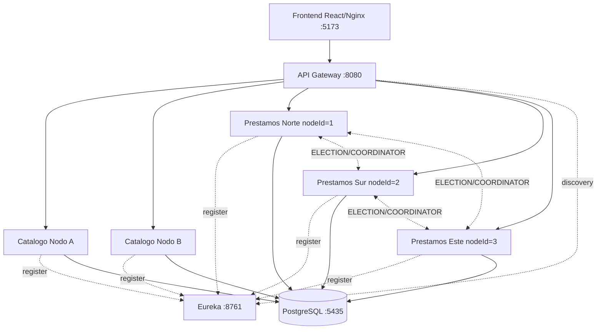

# Carrera Profesional de Ingenieria de Sistemas e Informatica

# "Reloj Global Comun y Latencia de la Red"

## Curso
Sistemas Distribuidos

## Profesor
Machuca Nuflo, Omar David

## Integrantes (Grupo 3)
- Paredes Merino, Zahid
- Rosales Alvarez, Kevin
- Olivares Chavez, Jeremi
- Cortez Pacheco, Angelo Jesus
- Martinez Esparza, Samuel Fabrizio

Lima - Peru  
2026

---

## 1. Resumen ejecutivo

LibroNet es un sistema distribuido porque integra multiples componentes desacoplados (microservicios de catalogo, prestamos, descubrimiento y enrutamiento) que se ejecutan en procesos y contenedores independientes, coordinados mediante paso de mensajes sobre red HTTP/REST. El usuario observa una unica aplicacion coherente, aunque internamente exista coordinacion entre nodos heterogeneos.

El problema de negocio es la gestion de inventario bibliotecario compartido entre sedes fisicas con concurrencia real y eventos de falla. La solucion implementa algoritmos y mecanismos distribuidos complementarios: exclusión mutua (bloqueo pesimista transaccional y simulacion academica con Dekker V5), sincronizacion temporal (Algoritmo de Cristian) y tolerancia a fallos con eleccion de lider en anillo logico (Chang-Roberts). Adicionalmente, se fortalecio la verificabilidad experimental del balanceo round-robin, la recuperacion de nodos caidos y la trazabilidad de eventos para sustentacion.

---

## 2. Introduccion

### 2.1 Presentacion del proyecto

LibroNet es una plataforma distribuida de gestion de prestamos y logistica inter-bibliotecaria. El sistema modela una red universitaria multi-sede con catalogo compartido y stock por sede. La arquitectura usa microservicios Spring Boot, frontend React, Netflix Eureka para descubrimiento dinamico y API Gateway como punto unico de acceso.

Su relevancia en Sistemas Distribuidos radica en que combina coordinacion de concurrencia, orden temporal global aproximado y reconfiguracion ante fallos, bajo un entorno de comunicacion distribuida y multiples nodos activos.

### 2.2 Problema tecnico

Ante solicitudes concurrentes y/o fallas de nodos, el sistema debe garantizar que:
- No se produzcan inconsistencias de inventario.
- Las marcas temporales sean auditables entre sedes con relojes divergentes.
- Las operaciones criticas inter-sede mantengan una politica consistente cuando no hay lider disponible.

---

## 3. Objetivos

### 3.1 Objetivo general

Desarrollar y validar un sistema de gestion bibliotecaria distribuido que garantice consistencia transaccional, coherencia temporal y tolerancia a fallos mediante algoritmos y mecanismos de coordinacion distribuida.

### 3.2 Objetivos especificos

- Implementar exclusión mutua para evitar condiciones de carrera al reservar libros, combinando simulacion algoritmica (Dekker V5) y bloqueo pesimista transaccional.
- Sincronizar marcas de tiempo entre nodos mediante el Algoritmo de Cristian, reduciendo impacto de deriva de reloj y latencia de red.
- Incorporar alta disponibilidad operativa con deteccion de caidas y re-eleccion automatica del coordinador en anillo logico.
- Evidenciar de manera verificable la politica de balanceo round-robin y la instancia destino por peticion.
- Ampliar escalabilidad funcional incorporando una tercera sede de prestamos sin reconfiguracion manual del anillo.

---

## 4. Alcance del proyecto

### 4.1 Incluye

- Descubrimiento dinamico de servicios con Netflix Eureka.
- Enrutamiento y balanceo de carga con API Gateway + Spring Cloud LoadBalancer (round-robin explicito).
- Simulacion en memoria de exclusion mutua con Dekker V5.
- Control de consistencia real con PESSIMISTIC_WRITE en PostgreSQL.
- Sincronizacion temporal con Cristian y almacenamiento de telemetria (drift, RTT, tiempo corregido).
- Modulo de logistica de prestamos (Pendiente de envio, En transito, Entregado).
- Eleccion de lider en anillo logico (Chang-Roberts) con deteccion de fallos.
- Recuperacion de nodos con resincronizacion previa a aceptar nuevas solicitudes.
- Modo auditoria en frontend con eventos de falla, eleccion y recuperacion.

### 4.2 No incluye

- Gestion completa de perfiles de lectores/estudiantes.
- Despliegue productivo en nube (operacion principal local con Docker Compose).
- Replicacion multi-master de base de datos distribuida.
- Implementacion de consenso fuerte tipo Raft/Paxos.

### 4.3 Supuestos y restricciones

- Entorno de red local confiable, con latencia y fallas simulables.
- Operaciones inter-sede dependen de existencia de lider activo.
- Persistencia de estado de eleccion local al proceso/contenedor, no a almacenamiento distribuido externo.

---

## 5. Descripcion del sistema

### 5.1 Actores

- Bibliotecario: usuario autenticado que opera en una sede y ejecuta prestamos/acciones logisticas.
- API Gateway: punto unico de entrada y servidor de tiempo de referencia.
- Nodos de prestamos: ejecutan logica de negocio, liderazgo y coordinacion distribuida.
- Nodos de catalogo: exponen consulta de inventario.

### 5.2 Funcionalidades principales

- Busqueda de catalogo en tiempo real con auto-polling.
- Prestamo fisico y digital con validacion transaccional.
- Registro de marcas temporales corregidas por Cristian.
- Simulacion de caida/restauracion de nodos y re-eleccion de lider.
- Historial de eventos distribuidos en panel de auditoria.

### 5.3 Casos de uso (resumen)

- Prestamo fisico con stock local.
- Prestamo inter-sede con autorizacion de lider.
- Caida y recuperacion de nodo durante operacion en curso.

---

## 6. Arquitectura distribuida

### 6.1 Diagrama de arquitectura

### 6.2 Nodos del sistema

- Nodo cliente: React sobre puerto 5173.
- Nodo enrutador: API Gateway sobre puerto 8080.
- Nodo de descubrimiento: Eureka sobre puerto 8761.
- Nodo de datos: PostgreSQL sobre puerto 5435 (host).
- Nodos de aplicacion:
  - Catalogo A y Catalogo B.
  - Prestamos Norte (nodeId 1), Sur (nodeId 2), Este (nodeId 3).

### 6.3 Servicios o componentes

- API Gateway: enrutamiento, balanceo round-robin, CORS y endpoint de tiempo.
- Prestamos Service: logica transaccional, eleccion en anillo, autorizacion inter-sede y recuperacion.
- Catalogo Service: consulta de inventario y endpoints de trazabilidad de instancia.
- Eureka: registro y descubrimiento dinamico.

### 6.4 Comunicacion entre componentes

- Externa: HTTP/REST a traves del Gateway.
- Interna de negocio: discovery por Eureka y llamadas por nombre logico.
- Interna de eleccion: mensajes peer-to-peer directos para ELECTION y COORDINATOR.

### 6.5 Identificadores y direccionamiento

- Nombres logicos: libronet-catalogo, libronet-prestamos, libronet-api-gateway.
- IDs de nodo: 1 (Norte), 2 (Sur), 3 (Este).
- IDs de recursos: UUID en libros y prestamos.

---

## 7. Tecnologias utilizadas

- Backend: Java 17, Spring Boot 3.x.
- Cloud: Spring Cloud Gateway, Spring Cloud LoadBalancer, Netflix Eureka.
- Frontend: React 18, Vite, Bootstrap.
- Persistencia: PostgreSQL 16 + Spring Data JPA.
- Contenedores: Docker y Docker Compose.

---

## 8. Diseno tecnico

### 8.1 Modulos del sistema

- Modulo de Seguridad:
  - Autenticacion real contra tabla bibliotecario.
  - Verificacion BCrypt.
  - Validacion de sede asociada al usuario.
  - No usa credenciales hardcoded en backend.

- Modulo de Logistica:
  - Gestion de transiciones de estado:
    - PENDIENTE_DE_ENVIO
    - EN_TRANSITO
    - ENTREGADO

- Modulo de Consenso/Liderazgo:
  - LiderEleccionService.
  - Heartbeat cada 5 segundos.
  - Mensajes ELECTION/COORDINATOR.
  - Retry con backoff para autorizacion inter-sede.
  - Resincronizacion al recuperar nodo.
  - Persistencia local de estado de eleccion.

### 8.2 Flujos principales

- Flujo local: lock pesimista -> descuento local -> Cristian -> persistencia de prestamo.
- Flujo inter-sede: lock -> solicitud al lider -> autorizacion -> descuento remoto -> estado logistico.
- Flujo de recuperacion: restaurar nodo -> estado RESYNC -> resincronizar -> aceptar peticiones.

### 8.3 Modelo de datos

Tabla libro:
- id, titulo, copias_norte, copias_sur, url_digital.

Tabla bibliotecario:
- username, password(BCrypt), sede, rol.

Tabla prestamo:
- id, libro_id, libro_titulo, bibliotecario, sede_solicitante,
- fecha_solicitud, fecha_local_sede,
- reloj_drift_ms, reloj_rtt_ms,
- estado, autorizado_por_lider.

### 8.4 Protocolos y endpoints principales

- GET /api/time
- GET /api/simulacion/dekker
- POST /api/prestamos/{libroId}?digital={bool}
- GET /api/prestamos
- PUT /api/prestamos/{id}/estado?estado={...}
- POST /api/auth/login
- GET /api/eleccion/estado
- GET /api/eleccion/eventos
- POST /api/eleccion/simular-caida?offline={bool}
- POST /api/eleccion/forzar-eleccion
- POST /api/eleccion/resincronizar

Trazabilidad de instancia:
- GET /api/catalogo/instancia
- GET /api/prestamos/instancia
- Headers:
  - X-Gateway-Routed-Host
  - X-LibroNet-Instance

---

## 9. Casos de uso desarrollados

### 9.1 Caso de uso A: Prestamo fisico con stock local

Actor principal:
- Bibliotecario.

Flujo principal:
1. Busca libro por catalogo.
2. Solicita prestamo fisico.
3. Servicio aplica lock pesimista.
4. Valida stock local > 0.
5. Descuenta stock local.
6. Ejecuta sincronizacion Cristian.
7. Registra prestamo ENTREGADO.

Flujos alternativos:
- Libro inexistente.
- Nodo en OFFLINE/RESYNC.
- Error transaccional.

Relacion con SD:
- Consistencia y exclusion mutua distribuida.

### 9.2 Caso de uso B: Prestamo inter-sede con autorizacion del lider

Actor principal:
- Bibliotecario en sede sin stock local.

Flujo principal:
1. Solicita prestamo fisico.
2. Servicio detecta stock remoto.
3. Solicita autorizacion al lider.
4. Lider autoriza.
5. Se descuenta stock remoto.
6. Se registra PENDIENTE_DE_ENVIO.

Flujos alternativos:
- Lider cae durante autorizacion -> retry/backoff + re-eleccion.
- Sin autorizacion tras reintentos -> rollback.

Relacion con SD:
- Coordinacion centralizada temporal y tolerancia a fallos.

### 9.3 Caso de uso C: Caida de nodo y re-eleccion durante prestamo en curso

Actor principal:
- Sistema distribuido (nodos) y bibliotecario.

Flujo principal:
1. Prestamo inter-sede en curso.
2. Caida simulada del lider.
3. Heartbeat detecta falla.
4. Se inicia ELECTION y luego COORDINATOR.
5. Nuevo lider asume coordinacion.
6. Nodo recuperado entra a RESYNC.
7. Nodo recuperado consulta estado y se integra sin lider fantasma.

Flujos alternativos:
- Timeout de resincronizacion.
- Mensajes obsoletos por termino anterior.

Relacion con SD:
- Reconfiguracion dinamica, disponibilidad y convergencia de estado.

---

## 10. Implementacion o evidencia funcional

### 10.1 Evidencias sugeridas

- Capturas del panel auditoria con:
  - Drift, RTT y tiempo corregido por prestamo.
  - Eventos de eleccion/recuperacion por nodo.
- Capturas de headers:
  - X-Gateway-Routed-Host
  - X-LibroNet-Instance
- Capturas de Eureka mostrando 2 catalogos y 3 prestamos activos.

### 10.2 Pruebas realizadas y resultado esperado

- Round-robin verificable:
  - Requests consecutivas alternan instancias.
- Caida de lider con prestamo inter-sede:
  - Retry y re-eleccion, luego autorizacion o rollback.
- Reincorporacion de nodo:
  - RESYNC previo, convergencia de lider y termino.

---

## 11. Aplicacion de conceptos de Sistemas Distribuidos

- Comunicacion entre procesos:
  - REST sincrono via gateway y P2P para anillo.

- Direccionamiento y descubrimiento:
  - Servicio por nombre logico en Eureka.

- Sincronizacion temporal:
  - Cristian para corregir tiempo por latencia (RTT/2).

- Concurrencia y consistencia:
  - Lock pesimista en base de datos.
  - Simulacion de Dekker como evidencia academica.

- Tolerancia a fallos:
  - Heartbeat, eleccion automatica y recuperacion controlada.

- Escalabilidad:
  - Inclusion de tercera sede sin cambios manuales en topologia fija.

---

## 12. Problemas encontrados y soluciones

Problema 1:
- Dificultad para demostrar balanceo de forma visible en demo.

Solucion:
- Se agregaron headers y logs de ruteo por peticion.

Problema 2:
- Falla de lider durante autorizacion inter-sede producia rechazo inmediato.

Solucion:
- Se implemento retry con backoff y disparo de nueva eleccion.

Problema 3:
- Riesgo de aceptar peticiones en nodo recien restaurado sin estado convergente.

Solucion:
- Estado RESYNC + endpoint de resincronizacion previo a habilitar negocio.

Problema 4:
- Coherencia documental de seguridad.

Solucion:
- Se actualizo a autenticacion real con BCrypt contra base de datos.

Lecciones aprendidas:
- La tolerancia a fallos efectiva requiere politica clara de operacion degradada.
- La observabilidad es clave para evidenciar propiedades distribuidas en sustentacion.

---

## 13. Conclusiones

LibroNet demuestra una implementacion funcional y verificable de conceptos centrales de Sistemas Distribuidos: exclusion mutua, sincronizacion de reloj, descubrimiento dinamico, eleccion de lider y manejo de fallas. La incorporacion de trazabilidad tecnica y recuperacion controlada fortalece la validez academica del proyecto y reduce la brecha entre teoria e implementacion.

### 13.1 Mejoras futuras

- Persistencia distribuida del estado de liderazgo.
- Estrategia de cola/reintento persistente para operaciones inter-sede.
- Pruebas de carga y latencia en escenarios de red no confiable.

---

## 14. Anexo para presentacion final

Para aterrizar las recomendaciones del docente en una sustentacion demostrativa, se agrego un anexo operativo con:

- Tabla formal de pruebas (escenario, esperado, obtenido, evidencia).
- Matriz concepto SD -> componente -> evidencia.
- Diferenciacion explicita entre Dekker academico y control real con PESSIMISTIC_WRITE.
- Lista de archivos/clases que deben mostrarse como evidencia de codigo.
- Trazabilidad por integrante.
- Guion de demo ordenada y plan de contingencia.
- Banco de preguntas para preparacion individual.

Documento:
- `plan_sustentacion_final.md`
- Evaluacion comparativa con protocolos de consenso (Raft).

### 13.2 Aprendizajes del equipo

- Integrar teoria de algoritmos distribuidos en una arquitectura real exige decisiones de trade-off entre simplicidad, disponibilidad y consistencia.
- La validacion experimental con evidencia observable es tan importante como la implementacion del algoritmo.

---

## 14. Referencias

- Spring Boot Documentation. https://docs.spring.io/spring-boot/docs/current/reference/html/
- Spring Cloud Gateway Documentation. https://docs.spring.io/spring-cloud-gateway/reference/
- Spring Cloud LoadBalancer Documentation. https://docs.spring.io/spring-cloud-commons/reference/spring-cloud-commons/loadbalancer.html
- Netflix Eureka (Spring Cloud Netflix). https://docs.spring.io/spring-cloud-netflix/docs/current/reference/html/
- PostgreSQL Documentation. https://www.postgresql.org/docs/
- Docker Documentation. https://docs.docker.com/
- Vite Documentation. https://vite.dev/guide/
- React Documentation. https://react.dev/
- Lamport, L. Time, Clocks, and the Ordering of Events in a Distributed System. CACM, 1978.
- Cristian, F. Probabilistic clock synchronization. Distributed Computing, 1989.
