# Documentación Final — LibroNet

## Sistema Distribuido de Préstamos Bibliotecarios

### Curso: Sistemas Distribuidos

### Profesor: Machuca Nuflo, Omar David

### Integrantes (Grupo 3)

| Integrante | Rol |
|---|---|
| Paredes Merino, Zahid | Arquitecto de solución |
| Rosales Alvarez, Kevin | Coordinador |
| Olivares Chavez, Jeremi | Responsable de implementación |
| Cortez Pacheco, Angelo Jesus | Responsable de exposición y QA |
| Martinez Esparza, Samuel Fabrizio | Responsable de documentación |

Lima — Perú, 2026

---

## Índice

1. [Resumen del Proyecto](#1-resumen-del-proyecto)
2. [Arquitectura General del Sistema](#2-arquitectura-general-del-sistema)
3. [Tema 1: Sincronización del Reloj](#3-tema-1-sincronización-del-reloj)
4. [Tema 2: Exclusión Mutua](#4-tema-2-exclusión-mutua)
5. [Tema 3: Algoritmos de Elección](#5-tema-3-algoritmos-de-elección)
6. [Tema 4: Introducción a Tolerancia a Fallas](#6-tema-4-introducción-a-tolerancia-a-fallas)
7. [Tema 5: Atenuación](#7-tema-5-atenuación)
8. [Tema 6: Comunicación](#8-tema-6-comunicación)
9. [Tema 7: Recuperación de Fallas](#9-tema-7-recuperación-de-fallas)
10. [Matriz Consolidada: Concepto → Implementación → Evidencia](#10-matriz-consolidada)
11. [Conclusiones](#11-conclusiones)
12. [Referencias Bibliográficas](#12-referencias-bibliográficas)

---

## 1. Resumen del Proyecto

**LibroNet** es un sistema distribuido de gestión de préstamos bibliotecarios interuniversitarios, desarrollado como proyecto integrador del curso de Sistemas Distribuidos. El sistema modela una red de sedes bibliotecarias (Norte, Sur y Este) que comparten un catálogo común y coordinan operaciones de préstamo físico y digital sobre una infraestructura de microservicios.

### 1.1 Problema de negocio

Cuando múltiples sedes operan sobre un inventario compartido de libros físicos, surgen tres desafíos fundamentales propios de los sistemas distribuidos:

1. **Concurrencia**: Dos bibliotecarios pueden solicitar simultáneamente el último ejemplar de un libro, generando condiciones de carrera (*race conditions*) que producirían sobreventa.
2. **Coordinación temporal**: Los relojes de cada nodo divergen, haciendo que las marcas de tiempo de los préstamos sean inconsistentes y no auditables.
3. **Disponibilidad ante fallas**: La caída de un nodo coordinador puede dejar operaciones inter-sede sin resolución, requiriendo mecanismos de detección, elección y recuperación automática.

### 1.2 Solución implementada

LibroNet resuelve estos desafíos mediante la integración de algoritmos y mecanismos clásicos de sistemas distribuidos:

| Desafío | Mecanismo implementado |
|---|---|
| Concurrencia sobre inventario | Bloqueo pesimista `PESSIMISTIC_WRITE` + Simulación de Dekker V5 |
| Coherencia temporal | Algoritmo de Cristian con servidor de tiempo en API Gateway |
| Coordinación y liderazgo | Algoritmo de Chang-Roberts en anillo lógico |
| Detección de fallas | Heartbeat periódico cada 5 segundos |
| Recuperación controlada | Estado `RESYNC` con resincronización previa |
| Comunicación distribuida | HTTP/REST vía API Gateway + P2P para mensajes de elección |

### 1.3 Stack tecnológico

- **Backend**: Java 17, Spring Boot 3.x, Spring Cloud Gateway, Spring Cloud LoadBalancer
- **Descubrimiento**: Netflix Eureka
- **Frontend**: React 18, Vite, Bootstrap
- **Persistencia**: PostgreSQL 16 + Spring Data JPA
- **Infraestructura**: Docker y Docker Compose

---

## 2. Arquitectura General del Sistema

### 2.1 Diagrama de arquitectura

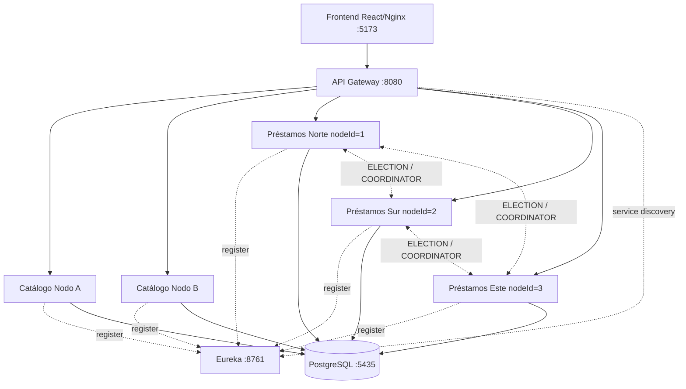

### 2.2 Componentes y nodos

| Componente | Tipo | Puerto | Función principal |
|---|---|---|---|
| Frontend | Cliente web | 5173 | Interfaz de usuario para bibliotecarios |
| API Gateway | Enrutador / Balanceador | 8080 | Punto único de entrada, balanceo round-robin, servidor de tiempo |
| Eureka | Registro de servicios | 8761 | Descubrimiento dinámico de instancias |
| Catálogo A y B | Microservicio (réplicas) | Dinámico | Consulta de inventario de libros |
| Préstamos Norte | Microservicio (nodeId=1) | Dinámico | Lógica de préstamos, sede Norte |
| Préstamos Sur | Microservicio (nodeId=2) | Dinámico | Lógica de préstamos, sede Sur |
| Préstamos Este | Microservicio (nodeId=3) | Dinámico | Lógica de préstamos, sede Este |
| PostgreSQL | Base de datos | 5435 | Persistencia centralizada |

### 2.3 Modelo de datos

```sql
-- Tabla de libros con stock por sede
CREATE TABLE libro (
    id UUID PRIMARY KEY,
    titulo VARCHAR(255),
    copias_norte INT NOT NULL DEFAULT 0,
    copias_sur INT NOT NULL DEFAULT 0,
    url_digital VARCHAR(500)
);

-- Tabla de préstamos con telemetría temporal
CREATE TABLE prestamo (
    id UUID PRIMARY KEY,
    libro_id UUID NOT NULL,
    libro_titulo VARCHAR(255) NOT NULL,
    bibliotecario VARCHAR(255) NOT NULL,
    sede_solicitante VARCHAR(255) NOT NULL,
    fecha_solicitud TIMESTAMP NOT NULL,     -- Tiempo corregido por Cristian
    fecha_local_sede TIMESTAMP,             -- Tiempo local sin corregir
    reloj_drift_ms BIGINT,                  -- Desfase configurado
    reloj_rtt_ms BIGINT,                    -- RTT medido
    estado VARCHAR(50) NOT NULL,            -- ENTREGADO, PENDIENTE_DE_ENVIO, EN_TRANSITO
    autorizado_por_lider INT                -- ID del líder que autorizó
);
```

---

## 3. Tema 1: Sincronización del Reloj

### 3.1 Fundamento teórico

En un sistema distribuido, cada nodo posee su propio reloj de hardware. Debido a diferencias en la frecuencia de los osciladores y a la ausencia de un reloj global compartido, los relojes de los nodos **divergen** progresivamente. Este fenómeno se denomina **deriva de reloj** (*clock drift*).

La **sincronización de reloj** busca que todos los nodos mantengan una noción temporal lo suficientemente cercana para que los eventos puedan ordenarse y auditarse de forma coherente. Se distinguen dos enfoques principales:

- **Relojes físicos**: Buscan aproximar la hora real (UTC). Algoritmos como el de **Cristian** y **Berkeley** pertenecen a esta categoría.
- **Relojes lógicos**: No buscan la hora real, sino un orden causal entre eventos. Ejemplos: **Lamport** y **relojes vectoriales**.

#### Algoritmo de Cristian (1989)

El Algoritmo de Cristian es un protocolo de sincronización de relojes físicos basado en un modelo **cliente-servidor**:

1. El cliente registra su tiempo local `T₀` antes de enviar la solicitud al servidor de tiempo.
2. El servidor responde con su tiempo actual `T_server`.
3. El cliente registra su tiempo local `T₁` al recibir la respuesta.
4. Se calcula el **Round-Trip Time (RTT)**: `RTT = T₁ - T₀`.
5. El tiempo corregido se estima como: `T_corregido = T_server + RTT/2`.

La fórmula `RTT/2` asume que la latencia de ida es aproximadamente igual a la de vuelta, lo que en redes locales es una aproximación razonable.

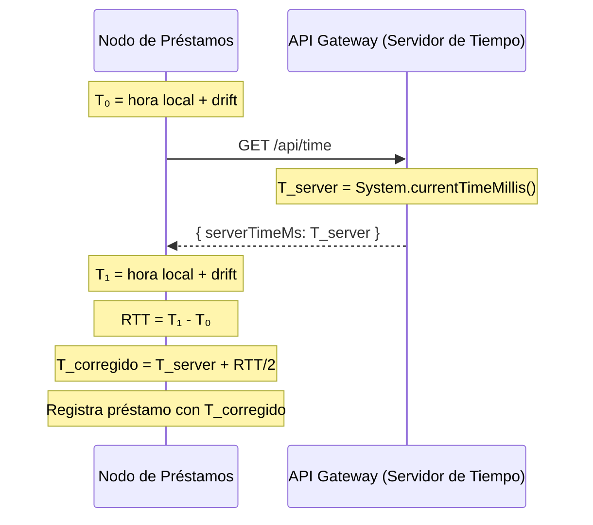

### 3.2 Implementación en LibroNet

#### Servidor de tiempo (API Gateway)

El API Gateway expone un endpoint `/api/time` que actúa como **servidor de tiempo de referencia**. Al estar centralizado en un único punto, todos los nodos de préstamos consultan la misma fuente temporal.

**Archivo**: `api-gateway/src/main/java/com/example/api_gateway/TimeController.java`

```java
@RestController
public class TimeController {

    @GetMapping("/api/time")
    public Mono<Map<String, Object>> getReferenceTime() {
        Map<String, Object> response = new HashMap<>();
        response.put("serverTimeMs", System.currentTimeMillis());
        return Mono.just(response);
    }
}
```

#### Cliente de sincronización (Servicio de Préstamos)

Cada nodo de préstamos ejecuta el Algoritmo de Cristian al momento de registrar un préstamo. El código se encuentra en `PrestamoService.procesarPrestamo()`:

**Archivo**: `prestamos-service/src/main/java/com/example/prestamos_service/service/PrestamoService.java`

```java
// Algoritmo de Cristian para sincronización de relojes físicos
long t0 = System.currentTimeMillis() + clockDriftMs;  // T₀ con drift simulado
long rtt = 0;
long tCorregido;

try {
    // Consulta al Servidor de Tiempo en el API Gateway a través de Eureka
    Map<String, Object> response = restTemplate.getForObject(
        "http://libronet-api-gateway/api/time", Map.class);
    long t1 = System.currentTimeMillis() + clockDriftMs;  // T₁ con drift

    if (response != null && response.containsKey("serverTimeMs")) {
        long serverTime = ((Number) response.get("serverTimeMs")).longValue();
        rtt = t1 - t0;                          // RTT = T₁ - T₀
        tCorregido = serverTime + (rtt / 2);     // T_corregido = T_server + RTT/2
    }
} catch (Exception e) {
    tCorregido = t1;  // Fallback: usar hora local
}
```

#### Drift simulable

El parámetro `reloj.drift-ms` (configurable por entorno) permite inyectar un desfase artificial al reloj local de cada nodo, lo que permite demostrar experimentalmente cómo el Algoritmo de Cristian corrige la divergencia:

```java
@Value("${reloj.drift-ms:0}")
private long clockDriftMs;
```

#### Persistencia de telemetría temporal

Cada préstamo registra los siguientes campos de telemetría:

| Campo | Descripción |
|---|---|
| `fecha_solicitud` | Tiempo corregido por Cristian (`T_corregido`) |
| `fecha_local_sede` | Tiempo local sin corregir (`T₀`) |
| `reloj_drift_ms` | Desfase configurado en el nodo |
| `reloj_rtt_ms` | RTT medido durante la sincronización |

### 3.3 Sincronización en la reincorporación de nodos

Cuando un nodo se recupera de una caída simulada, ejecuta una resincronización de reloj como parte del proceso de reincorporación:

**Archivo**: `prestamos-service/src/main/java/com/example/prestamos_service/service/LiderEleccionService.java`

```java
private void sincronizarRelojCristianParaReincorporacion() {
    List<ServiceInstance> gateways = discoveryClient.getInstances("libronet-api-gateway");
    ServiceInstance gateway = gateways.get(0);
    String url = gateway.getUri() + "/api/time";

    long t0 = System.currentTimeMillis();
    Map<String, Object> response = directRestTemplate.getForObject(url, Map.class);
    long t1 = System.currentTimeMillis();

    long serverTimeMs = ((Number) response.get("serverTimeMs")).longValue();
    long rtt = t1 - t0;
    this.lastClockSyncMs = serverTimeMs + (rtt / 2);  // Cristian
}
```

### 3.4 Análisis crítico

| Aspecto | Valoración |
|---|---|
| **Precisión** | Adecuada para redes locales con RTT simétrico; en WAN la asimetría de latencia introduce error |
| **Punto único de fallo** | El servidor de tiempo es el API Gateway; si cae, se usa hora local como fallback |
| **Audibilidad** | Excelente: cada préstamo almacena drift, RTT y tiempo corregido |
| **Mejora futura** | Complementar con NTP externo o algoritmo de Berkeley para consenso entre pares |

---

## 4. Tema 2: Exclusión Mutua

### 4.1 Fundamento teórico

La **exclusión mutua** es la propiedad que garantiza que, en un momento dado, **solo un proceso** puede ejecutar su **sección crítica** — la porción de código que accede a un recurso compartido. En sistemas distribuidos, esto es esencial para evitar:

- **Condiciones de carrera** (*race conditions*): Dos procesos leen y modifican el mismo dato simultáneamente.
- **Inconsistencias de datos**: El recurso queda en un estado no válido después de accesos concurrentes.

Existen dos grandes categorías de soluciones:

#### Algoritmos de software (nivel de proceso)

Resuelven la exclusión mutua entre procesos/hilos usando únicamente variables compartidas en memoria, sin primitivas del sistema operativo. Ejemplo clásico: **Algoritmo de Dekker**.

#### Mecanismos transaccionales (nivel de datos)

Delegan la exclusión mutua al sistema de gestión de base de datos mediante **bloqueos pesimistas** (`SELECT ... FOR UPDATE`) que serializan el acceso a filas específicas.

### 4.2 Implementación A: Simulación académica con Dekker V5

#### Descripción

El **Algoritmo de Dekker (Versión 5)** es el primer algoritmo conocido que resuelve la exclusión mutua entre dos procesos concurrentes usando solo variables compartidas, sin soporte de hardware especial. Garantiza tres propiedades:

1. **Exclusión mutua**: Solo un proceso a la vez en la sección crítica.
2. **Progreso**: Si ningún proceso está en la sección crítica, uno podrá entrar.
3. **Ausencia de inanición**: Ningún proceso espera indefinidamente.

**Archivo**: `prestamos-service/src/main/java/com/example/prestamos_service/controller/DekkerSimulationController.java`

```java
@RestController
@RequestMapping("/api/simulacion")
public class DekkerSimulationController {

    // Variables compartidas (Dekker V5)
    private volatile boolean quiereEntrarSedeNorte = false;
    private volatile boolean quiereEntrarSedeSur = false;
    private volatile int turno = 1;              // 1 = Norte, 2 = Sur
    private volatile int inventarioSimulado = 1;  // El recurso compartido

    @GetMapping("/dekker")
    public ResponseEntity<List<String>> ejecutarDekkerV5() {
        // Reinicio de variables
        quiereEntrarSedeNorte = false;
        quiereEntrarSedeSur = false;
        turno = 1;
        inventarioSimulado = 1;

        List<String> bitacoraEventos = new CopyOnWriteArrayList<>();

        // Hilo 1: Sede Norte
        Thread sedeNorte = new Thread(() -> {
            quiereEntrarSedeNorte = true;
            while (quiereEntrarSedeSur) {
                if (turno == 2) {
                    quiereEntrarSedeNorte = false;    // Retroceso voluntario
                    while (turno == 2) { /* espera */ }
                    quiereEntrarSedeNorte = true;
                }
            }
            // --- SECCIÓN CRÍTICA ---
            if (inventarioSimulado > 0) {
                inventarioSimulado--;
            }
            // --- FIN SECCIÓN CRÍTICA ---
            turno = 2;
            quiereEntrarSedeNorte = false;
        });

        // Hilo 2: Sede Sur (lógica simétrica)
        Thread sedeSur = new Thread(() -> { /* ... */ });

        sedeNorte.start();
        sedeSur.start();
        sedeNorte.join();
        sedeSur.join();

        return ResponseEntity.ok(bitacoraEventos);
    }
}
```

#### Diagrama del flujo de Dekker V5

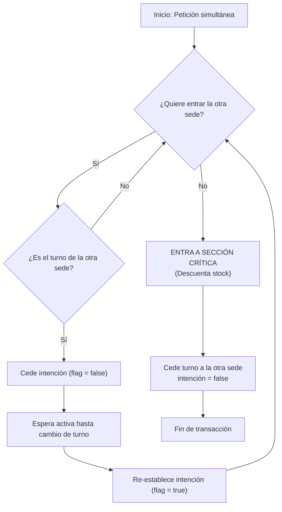

#### Aspectos técnicos clave

- **`volatile`**: Las variables `quiereEntrarSedeNorte`, `quiereEntrarSedeSur` y `turno` se declaran `volatile` para garantizar visibilidad inmediata entre hilos, evitando que la JVM los mantenga en caché de CPU.
- **Retroceso voluntario**: La V5 soluciona el deadlock de versiones anteriores haciendo que el proceso cuyo turno no es el actual retire temporalmente su intención.

### 4.3 Implementación B: Bloqueo pesimista transaccional (producción)

#### Descripción

Para el control real de inventario en un entorno multi-nodo, la exclusión mutua se delega al **motor de base de datos** mediante `PESSIMISTIC_WRITE`, que traduce a `SELECT ... FOR UPDATE` en PostgreSQL.

**Archivo**: `prestamos-service/src/main/java/com/example/prestamos_service/repository/LibroRepository.java`

```java
public interface LibroRepository extends JpaRepository<Libro, UUID> {

    // El núcleo de la consistencia fuerte
    @Lock(LockModeType.PESSIMISTIC_WRITE)
    @Query("SELECT l FROM Libro l WHERE l.id = :id")
    Optional<Libro> findByIdForUpdate(@Param("id") UUID id);
}
```

#### Flujo transaccional

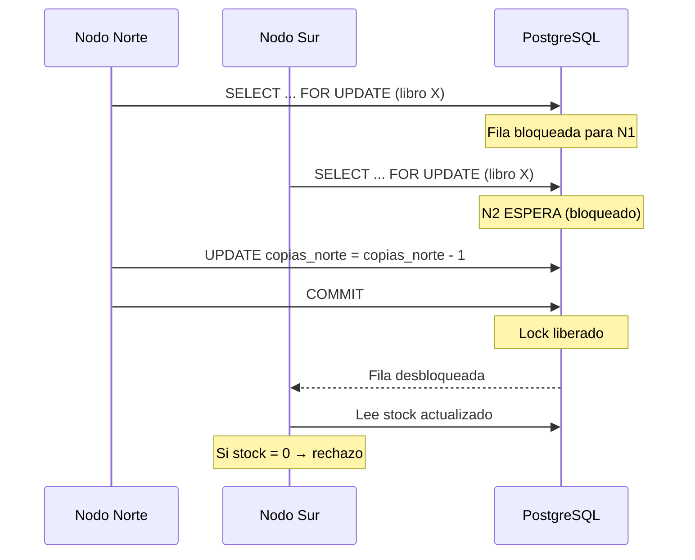

### 4.4 Diferencia clave: Dekker vs PESSIMISTIC_WRITE

| Aspecto | Dekker V5 | PESSIMISTIC_WRITE |
|---|---|---|
| **Rol en LibroNet** | Simulación académica / didáctica | Control real de producción |
| **Alcance** | Hilos dentro de una misma JVM | Transacciones entre nodos distribuidos |
| **Escalabilidad** | 2 procesos fijos | N nodos concurrentes |
| **Garantía** | Exclusión mutua in-memory | Serialización transaccional en BD |
| **Limitación** | No coordina nodos distribuidos | Depende de disponibilidad de PostgreSQL |

> **Nota para sustentación**: "En LibroNet usamos Dekker V5 como simulación académica para demostrar el principio de exclusión mutua. El control real de inventario en producción se garantiza con bloqueo pesimista transaccional en PostgreSQL mediante `PESSIMISTIC_WRITE`."

---

## 5. Tema 3: Algoritmos de Elección

### 5.1 Fundamento teórico

En un sistema distribuido, ciertas operaciones requieren un **nodo coordinador** (líder) que centralice decisiones como la autorización de operaciones inter-sede. Un **algoritmo de elección** permite que los nodos seleccionen dinámicamente un coordinador cuando:

- El sistema arranca por primera vez.
- El coordinador actual falla o se desconecta.
- Un nodo con mayor prioridad se reincorpora al sistema.

#### Algoritmo de Chang-Roberts (1979)

El algoritmo de **Chang-Roberts** opera sobre una topología de **anillo lógico unidireccional**:

1. Cualquier nodo puede iniciar una elección enviando un mensaje `ELECTION` con su ID al siguiente nodo del anillo.
2. Cada nodo que recibe el mensaje compara el ID candidato con su propio ID:
   - Si el candidato tiene **mayor ID**, lo reenvía al siguiente.
   - Si el candidato tiene **menor ID**, sustituye el ID por el propio y lo reenvía.
   - Si el mensaje contiene **su propio ID**, significa que recorrió todo el anillo: este nodo es el líder.
3. El nodo ganador difunde un mensaje `COORDINATOR` por el anillo para informar a todos.

### 5.2 Implementación en LibroNet

#### Topología del anillo

Los nodos de préstamos forman un anillo lógico ordenado por `nodeId`:

```
Norte (1) → Sur (2) → Este (3) → Norte (1) → ...
```

El anillo se construye dinámicamente consultando Eureka:

**Archivo**: `prestamos-service/src/main/java/com/example/prestamos_service/service/LiderEleccionService.java`

```java
public List<NodeInfo> getActiveNodesInRing() {
    List<ServiceInstance> instances = discoveryClient.getInstances("libronet-prestamos");
    List<NodeInfo> nodes = new ArrayList<>();

    for (ServiceInstance instance : instances) {
        String nodeIdStr = instance.getMetadata().get("nodeId");
        String name = instance.getMetadata().get("sede");
        if (nodeIdStr != null) {
            int id = Integer.parseInt(nodeIdStr);
            String uri = instance.getUri().toString();
            nodes.add(new NodeInfo(id, name != null ? name : "Nodo " + id, uri));
        }
    }

    nodes.sort(Comparator.comparingInt(NodeInfo::getId));  // Orden del anillo
    return nodes;
}
```

#### Inicio de elección

```java
public synchronized void iniciarEleccion() {
    if (isOffline) return;

    this.liderazgoEpoca++;         // Incrementa el término (época)
    this.estadoNode = "ELECTION";
    this.liderId = -1;
    this.acceptingRequests = false;
    guardarEstadoPersistido();

    enviarMensajeEleccion(nodeId, this.liderazgoEpoca);
}
```

#### Procesamiento de mensaje ELECTION

```java
public synchronized void procesarMensajeEleccion(int candidateId, long term) {
    if (isOffline) throw new RuntimeException("Nodo caído");

    // Ignorar mensajes de épocas obsoletas
    if (term < this.liderazgoEpoca) return;

    if (candidateId > this.nodeId) {
        // Candidato superior → reenviarlo al siguiente en el anillo
        enviarMensajeEleccion(candidateId, term);
    } else if (candidateId < this.nodeId) {
        // Mi ID es mayor → enviar mi propio ID como candidato
        enviarMensajeEleccion(this.nodeId, term);
    } else {
        // Mi propio ID retornó → SOY EL LÍDER
        declararLider(term);
    }
}
```

#### Declaración de líder y propagación de COORDINATOR

```java
private void declararLider(long term) {
    this.liderId = this.nodeId;
    this.estadoNode = "NORMAL";
    this.acceptingRequests = true;

    enviarMensajeCoordinador(this.nodeId, term);  // Difundir por el anillo
}

public synchronized void procesarMensajeCoordinador(int leaderId, long term) {
    if (term < this.liderazgoEpoca) return;  // Ignorar términos obsoletos

    this.liderId = leaderId;
    this.estadoNode = "NORMAL";
    this.acceptingRequests = true;

    if (leaderId != this.nodeId) {
        enviarMensajeCoordinador(leaderId, term);  // Propagar al siguiente
    }
}
```

#### Diagrama del flujo de elección

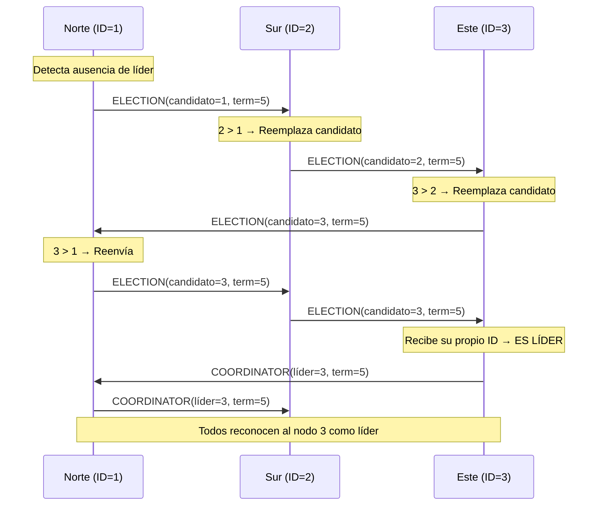

### 5.3 Mecanismo de épocas (términos)

Para evitar que mensajes de elecciones previas interfieran con elecciones actuales, LibroNet implementa un sistema de **épocas** (`liderazgoEpoca`):

- Cada nueva elección incrementa la época.
- Mensajes con épocas menores a la actual se ignoran.
- Esto previene el escenario de **split-brain** donde dos nodos creen ser líder simultáneamente de términos diferentes.

### 5.4 Endpoints de elección

| Endpoint | Método | Función |
|---|---|---|
| `/api/eleccion/estado` | GET | Estado actual del nodo (líder, época, anillo) |
| `/api/eleccion/eventos` | GET | Historial de eventos de elección |
| `/api/eleccion/forzar-eleccion` | POST | Inicia una elección manual |
| `/api/eleccion/simular-caida` | POST | Simula caída/restauración de nodo |
| `/api/eleccion/mensaje/election` | GET | Recibe mensajes ELECTION del anillo |
| `/api/eleccion/mensaje/coordinator` | GET | Recibe mensajes COORDINATOR del anillo |
| `/api/eleccion/autorizar-prestamo-inter-sede` | GET | El líder autoriza préstamos inter-sede |

---

## 6. Tema 4: Introducción a Tolerancia a Fallas

### 6.1 Fundamento teórico

La **tolerancia a fallas** es la capacidad de un sistema distribuido de continuar operando correctamente (posiblemente de forma degradada) ante la falla de uno o más de sus componentes. Se distinguen varios tipos de fallas:

| Tipo de falla | Descripción | Ejemplo en LibroNet |
|---|---|---|
| **Falla por caída** (*crash*) | El nodo deja de funcionar abruptamente | Nodo de préstamos se desconecta |
| **Falla por omisión** | El nodo no envía o recibe mensajes esperados | Timeout en ping al líder |
| **Falla de temporización** | Respuesta fuera del tiempo esperado | RTT excesivo en sincronización |
| **Falla bizantina** | El nodo opera de forma arbitrariamente incorrecta | No implementado (fuera de alcance) |

### 6.2 Modelo de tolerancia implementado en LibroNet

LibroNet implementa tolerancia ante **fallas por caída** y **fallas por omisión** mediante cuatro pilares:

#### Pilar 1: Detección de fallas por Heartbeat

Un monitor periódico (`@Scheduled`) verifica cada 5 segundos si el líder sigue activo:

```java
@Scheduled(fixedRate = 5000)
public void verificarLider() {
    if (isOffline) return;

    // Si no hay líder definido, iniciar elección
    if (this.liderId == -1) {
        if ("NORMAL".equals(this.estadoNode)) {
            iniciarEleccion();
        }
        return;
    }

    // Si este nodo es líder, verificar que no haya nodos con ID superior
    if (this.liderId == this.nodeId) {
        List<NodeInfo> ring = getActiveNodesInRing();
        boolean haySuperior = ring.stream().anyMatch(n -> n.getId() > this.nodeId);
        if (haySuperior) {
            iniciarEleccion();  // Re-elección preventiva
        }
        return;
    }

    // Verificar que el líder responde al ping
    try {
        String pingUrl = leaderNode.get().getUri() + "/api/eleccion/ping";
        String response = directRestTemplate.getForObject(pingUrl, String.class);
        if (!"pong".equalsIgnoreCase(response)) {
            throw new RuntimeException("Respuesta incorrecta");
        }
    } catch (Exception e) {
        iniciarEleccion();  // Líder inalcanzable → nueva elección
    }
}
```

#### Pilar 2: Re-elección automática

Cuando el heartbeat detecta que el líder no responde:
1. Se invalida el líder actual (`liderId = -1`).
2. Se inicia una nueva elección por Chang-Roberts.
3. El nodo con mayor ID activo asume el liderazgo.

#### Pilar 3: Operación degradada (graceful degradation)

No todas las operaciones dependen del líder. LibroNet implementa una **política de degradación selectiva**:

| Operación | ¿Requiere líder? | Comportamiento sin líder |
|---|---|---|
| Préstamo local (con stock) | ❌ No | Funciona normalmente |
| Préstamo digital | ❌ No | Funciona normalmente |
| Búsqueda de catálogo | ❌ No | Funciona normalmente |
| Préstamo inter-sede | ✅ Sí | Retry con backoff → rollback si no converge |

#### Pilar 4: Simulación controlada de fallas

El sistema permite simular caídas de nodos para demostración y pruebas:

```java
public synchronized void setOffline(boolean offline) {
    this.isOffline = offline;
    if (offline) {
        this.liderId = -1;
        this.acceptingRequests = false;
        this.liderazgoEpoca++;
    } else {
        this.estadoNode = "RESYNC";  // Inicia recuperación controlada
        resincronizarNodo();
    }
}
```

### 6.3 Ventana de indisponibilidad

Durante una falla del líder, existe una ventana temporal donde los préstamos inter-sede no pueden autorizarse:

| Fase | Tiempo estimado |
|---|---|
| Detección por heartbeat | Hasta 5 segundos |
| Elección + propagación | Sub-segundos a pocos segundos |
| **Ventana total** | **~5 a 8 segundos** |

### 6.4 Diagrama de transición de estados del nodo

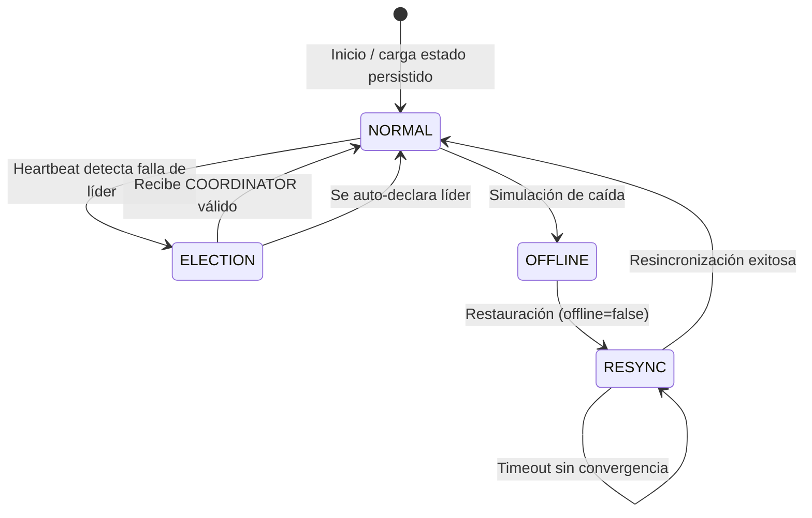

---

## 7. Tema 5: Atenuación

### 7.1 Fundamento teórico

La **atenuación** (*mitigation*) en sistemas distribuidos se refiere a las técnicas y estrategias empleadas para **reducir el impacto** de las fallas, en lugar de simplemente prevenirlas. Mientras que la tolerancia a fallas se enfoca en detectar y reaccionar ante errores, la atenuación se centra en minimizar la propagación del daño y mantener la calidad de servicio durante y después de una falla.

Las estrategias de atenuación incluyen:

- **Retry con backoff exponencial**: Reintentar operaciones fallidas con intervalos crecientes.
- **Circuit breaker**: Detener temporalmente las solicitudes a un servicio que falla repetidamente.
- **Degradación selectiva**: Limitar funcionalidad en lugar de fallar completamente.
- **Balanceo de carga**: Distribuir la carga para evitar sobrecarga en nodos individuales.
- **Timeouts**: Establecer límites de tiempo para evitar esperas indefinidas.

### 7.2 Implementación de atenuación en LibroNet

#### 7.2.1 Retry con backoff exponencial

Cuando un nodo solicita autorización inter-sede al líder y este falla, no se rechaza inmediatamente. En su lugar, se implementa un mecanismo de **retry con backoff exponencial**:

**Archivo**: `prestamos-service/src/main/java/com/example/prestamos_service/service/LiderEleccionService.java`

```java
private static final int AUTH_MAX_REINTENTOS = 6;
private static final long AUTH_BACKOFF_INICIAL_MS = 300;
private static final long AUTH_BACKOFF_MAX_MS = 2000;

public boolean solicitarAutorizacionInterSede(UUID libroId, String sedeSolicitante) {
    long backoff = AUTH_BACKOFF_INICIAL_MS;

    for (int intento = 1; intento <= AUTH_MAX_REINTENTOS; intento++) {
        Optional<NodeInfo> liderOpt = obtenerNodoLider();

        if (!liderOpt.isPresent()) {
            // Sin líder disponible → disparar elección y esperar
            iniciarEleccion();
            sleepSilently(backoff);
            backoff = Math.min(backoff * 2, AUTH_BACKOFF_MAX_MS);
            continue;
        }

        try {
            // Intentar autorización
            Map<String, Object> response = directRestTemplate.getForObject(url, Map.class);
            if (Boolean.TRUE.equals(response.get("autorizado"))) {
                return true;  // Éxito
            }
        } catch (Exception e) {
            // Líder inaccesible → invalidar y disparar nueva elección
            liderId = -1;
            iniciarEleccion();
        }

        sleepSilently(backoff);
        backoff = Math.min(backoff * 2, AUTH_BACKOFF_MAX_MS);  // Backoff exponencial
    }

    return false;  // Agotados los reintentos → rollback transaccional
}
```

La progresión del backoff es:

| Intento | Espera (ms) |
|---|---|
| 1 | 300 |
| 2 | 600 |
| 3 | 1200 |
| 4 | 2000 (tope) |
| 5 | 2000 |
| 6 | 2000 |

#### 7.2.2 Rollback transaccional como protección

Si los reintentos se agotan sin lograr autorización, el sistema no deja el préstamo en un estado intermedio. Gracias a la anotación `@Transactional`, toda la operación se revierte:

```java
@Transactional
public String procesarPrestamo(UUID libroId, String sede, ...) {
    // ... lock pesimista ...

    boolean autorizado = liderEleccionService.solicitarAutorizacionInterSede(libroId, sede);
    if (!autorizado) {
        throw new RuntimeException("Préstamo inter-sede NO autorizado por el líder.");
        // La excepción dentro de @Transactional causa ROLLBACK automático
    }
    // Si autorizado → continúa con descuento y persistencia
}
```

#### 7.2.3 Balanceo de carga (round-robin)

El API Gateway distribuye las solicitudes entre las instancias de cada servicio usando **round-robin**, lo que atenúa la sobrecarga de nodos individuales:

**Archivo**: `api-gateway/src/main/java/com/example/api_gateway/GatewayRoundRobinLoadBalancerConfig.java`

```java
@Configuration
public class GatewayRoundRobinLoadBalancerConfig {

    @Bean
    ReactorServiceInstanceLoadBalancer reactorServiceInstanceLoadBalancer(
            Environment environment,
            LoadBalancerClientFactory loadBalancerClientFactory) {

        String serviceId = environment.getProperty(
            LoadBalancerClientFactory.PROPERTY_NAME);
        return new RoundRobinLoadBalancer(
            loadBalancerClientFactory.getLazyProvider(
                serviceId, ServiceInstanceListSupplier.class),
            serviceId
        );
    }
}
```

#### 7.2.4 Protección contra aceptación de negocio en estado inestable

Un nodo recién restaurado no acepta solicitudes de negocio hasta completar la resincronización:

```java
// En PrestamoController
if (!liderEleccionService.isAcceptingRequests()) {
    return ResponseEntity.status(503)
        .body("Nodo en resincronización. Reintente en unos segundos.");
}
```

#### 7.2.5 Filtrado de mensajes con época obsoleta

Los mensajes de elección con un término inferior al actual se descartan, evitando la interferencia de elecciones antiguas:

```java
if (term < this.liderazgoEpoca) {
    registrarEvento("INFO", "ELECTION obsoleto ignorado. term=" + term);
    return;  // Mensaje descartado
}
```

### 7.3 Diagrama de estrategia de atenuación

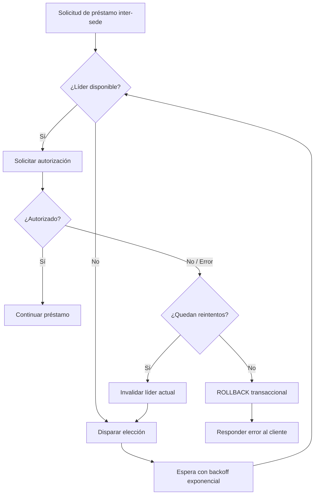

---

## 8. Tema 6: Comunicación

### 8.1 Fundamento teórico

La **comunicación** en un sistema distribuido es el mecanismo mediante el cual los procesos que residen en nodos diferentes intercambian información para coordinar sus acciones. Los aspectos clave incluyen:

- **Modelo de comunicación**: Síncrono vs asíncrono.
- **Paradigma**: Paso de mensajes, llamada a procedimiento remoto (RPC), comunicación basada en eventos.
- **Protocolo de transporte**: TCP, HTTP, gRPC, colas de mensajes.
- **Descubrimiento**: Cómo localizar dinámicamente a otros servicios.
- **Enrutamiento**: Cómo dirigir las solicitudes al destino correcto.

### 8.2 Capas de comunicación en LibroNet

LibroNet implementa tres capas distintas de comunicación:

#### Capa 1: Comunicación externa (Cliente → Gateway → Servicios)

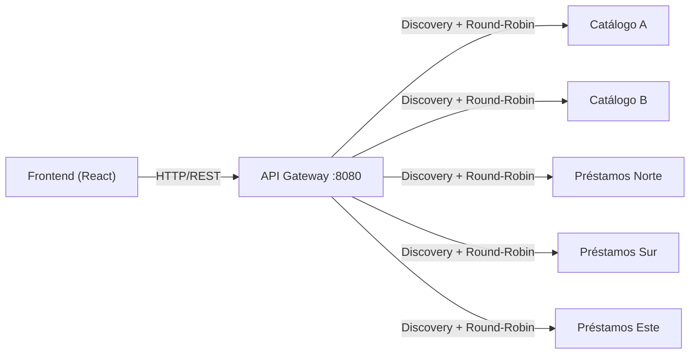

- **Protocolo**: HTTP/REST sobre TCP.
- **Modelo**: Síncrono (request-response).
- **Enrutamiento**: Spring Cloud Gateway con rutas por path prefix.
- **Balanceo**: Round-robin explícito vía Spring Cloud LoadBalancer.

#### Capa 2: Comunicación interna de negocio (Servicio → Servicio vía Eureka)

Los servicios se comunican entre sí usando **nombres lógicos** resueltos por Eureka:

```java
// Comunicación por nombre lógico (no por IP/puerto fijo)
restTemplate.getForObject("http://libronet-api-gateway/api/time", Map.class);
```

- **Descubrimiento**: Netflix Eureka registra instancias con nombre lógico (`libronet-catalogo`, `libronet-prestamos`, `libronet-api-gateway`).
- **Resolución**: El `RestTemplate` con `@LoadBalanced` resuelve el nombre lógico a una instancia concreta.
- **Ventaja**: No hay dependencias estáticas de IP/puerto; los servicios pueden escalar o migrar sin reconfiguración.

#### Capa 3: Comunicación peer-to-peer para elección (Nodo → Nodo directo)

Los mensajes de elección (`ELECTION` y `COORDINATOR`) se envían directamente entre nodos sin pasar por el Gateway:

```java
private void enviarAsync(String targetUrl, String targetName, String tipoMensaje) {
    electionExecutor.execute(() -> {
        try {
            directRestTemplate.getForObject(targetUrl, String.class);
        } catch (Exception e) {
            registrarEvento("WARN", "Fallo envío de " + tipoMensaje + " a " + targetName);
        }
    });
}
```

- **Protocolo**: HTTP/REST directo (sin Gateway).
- **Modelo**: Asíncrono (envío en thread separado via `ExecutorService`).
- **Dirección**: URI obtenida directamente de Eureka.
- **Justificación**: Los mensajes de elección deben evitar el Gateway para no crear dependencia circular y para reducir latencia.

### 8.3 Trazabilidad de comunicación

El sistema implementa mecanismos de **observabilidad** que permiten rastrear cada petición:

#### Headers de trazabilidad

| Header | Fuente | Contenido |
|---|---|---|
| `X-Gateway-Routed-Host` | API Gateway | Host:puerto del servicio destino |
| `X-LibroNet-Instance` | Microservicios | Identificador de la instancia que procesó la petición |

#### Filtro de auditoría de rutas

**Archivo**: `api-gateway/src/main/java/com/example/api_gateway/GatewayRouteAuditFilter.java`

```java
@Component
public class GatewayRouteAuditFilter implements GlobalFilter, Ordered {

    @Override
    public Mono<Void> filter(ServerWebExchange exchange, GatewayFilterChain chain) {
        return chain.filter(exchange).then(Mono.fromRunnable(() -> {
            URI routedUri = exchange.getAttribute(GATEWAY_REQUEST_URL_ATTR);
            if (routedUri != null) {
                String target = routedUri.getHost() + ":" + routedUri.getPort();
                exchange.getResponse().getHeaders()
                    .set("X-Gateway-Routed-Host", target);

                log.info("[ROUTING] method={} path={} target={}",
                    exchange.getRequest().getMethod(),
                    exchange.getRequest().getURI().getPath(),
                    routedUri);
            }
        }));
    }
}
```

### 8.4 Descubrimiento dinámico con Eureka

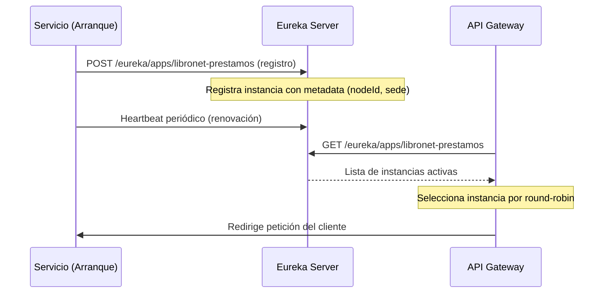

### 8.5 Endpoints de comunicación del sistema

| Categoría | Endpoint | Método | Descripción |
|---|---|---|---|
| **Autenticación** | `/api/auth/login` | POST | Login de bibliotecario |
| **Catálogo** | `/api/catalogo/buscar?query=` | GET | Búsqueda de libros |
| **Catálogo** | `/api/catalogo/instancia` | GET | Identifica instancia servidora |
| **Préstamos** | `/api/prestamos/{libroId}` | POST | Solicitar préstamo |
| **Préstamos** | `/api/prestamos` | GET | Listar todos los préstamos |
| **Préstamos** | `/api/prestamos/{id}/estado` | PUT | Actualizar estado logístico |
| **Tiempo** | `/api/time` | GET | Servidor de tiempo (Cristian) |
| **Simulación** | `/api/simulacion/dekker` | GET | Ejecutar simulación de Dekker V5 |
| **Elección** | `/api/eleccion/estado` | GET | Estado del nodo en el anillo |
| **Elección** | `/api/eleccion/eventos` | GET | Historial de eventos de elección |
| **Elección** | `/api/eleccion/simular-caida` | POST | Simular caída de nodo |
| **Elección** | `/api/eleccion/forzar-eleccion` | POST | Forzar nueva elección |
| **Elección** | `/api/eleccion/resincronizar` | POST | Resincronizar nodo recuperado |

---

## 9. Tema 7: Recuperación de Fallas

### 9.1 Fundamento teórico

La **recuperación de fallas** (*failure recovery*) es el proceso mediante el cual un sistema distribuido restaura su estado consistente después de que un componente fallido vuelve a estar disponible. A diferencia de la tolerancia a fallas (que actúa *durante* la falla), la recuperación actúa *después* de que el componente se ha restaurado.

Los desafíos principales de la recuperación incluyen:

1. **Consistencia de estado**: El nodo restaurado puede tener información obsoleta.
2. **Prevención de split-brain**: Evitar que el nodo restaurado se considere líder cuando ya hay otro.
3. **Convergencia**: Todos los nodos deben acordar un único líder y época.
4. **Seguridad operativa**: No aceptar operaciones de negocio hasta que el estado esté sincronizado.

### 9.2 Proceso de recuperación en LibroNet

LibroNet implementa un protocolo de recuperación en tres fases:

#### Fase 1: Transición a RESYNC

Cuando un nodo se restaura (`offline=false`), no vuelve inmediatamente a operar. En su lugar, entra en estado `RESYNC`:

```java
public synchronized void setOffline(boolean offline) {
    if (!offline) {  // Restauración
        this.acceptingRequests = false;  // NO acepta negocio
        this.estadoNode = "RESYNC";      // Estado de recuperación
        resincronizarNodo();             // Inicia protocolo
    }
}
```

#### Fase 2: Resincronización

El método `resincronizarNodo()` ejecuta una secuencia ordenada de validaciones:

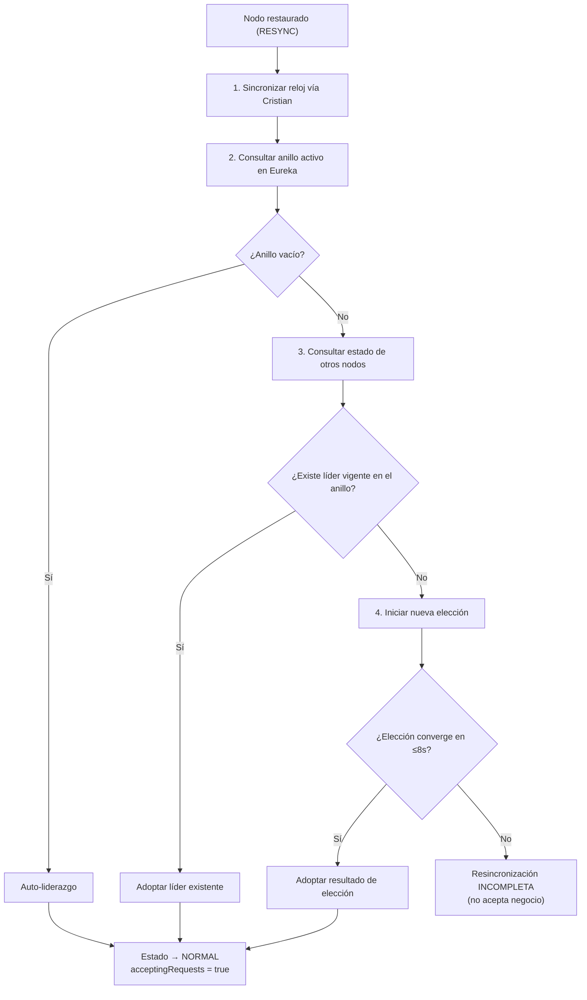

**Código del protocolo de resincronización**:

```java
public synchronized boolean resincronizarNodo() {
    if (isOffline) return false;

    estadoNode = "RESYNC";
    acceptingRequests = false;

    // Paso 1: Resincronizar reloj
    sincronizarRelojCristianParaReincorporacion();

    // Paso 2: Obtener anillo activo
    List<NodeInfo> ring = getActiveNodesInRing();
    if (ring.isEmpty()) {
        liderId = nodeId;  // Auto-liderazgo
        estadoNode = "NORMAL";
        acceptingRequests = true;
        return true;
    }

    // Paso 3: Consultar líderes de otros nodos
    Integer liderDetectado = null;
    long terminoDetectado = liderazgoEpoca;

    for (NodeInfo node : ring) {
        if (node.getId() == nodeId) continue;
        try {
            Map<String, Object> estadoRemoto = directRestTemplate
                .getForObject(node.getUri() + "/api/eleccion/estado", Map.class);
            long remotoTerm = toLong(estadoRemoto.get("liderazgoEpoca"), 0L);
            int remotoLider = toInt(estadoRemoto.get("liderId"), -1);

            if (remotoTerm > terminoDetectado) terminoDetectado = remotoTerm;
            if (!remotoOffline && remotoLider > 0) liderDetectado = remotoLider;
        } catch (Exception e) { /* continuar con siguiente nodo */ }
    }

    // Paso 4: Decidir si adoptar líder o re-elegir
    liderazgoEpoca = Math.max(liderazgoEpoca, terminoDetectado);

    if (liderDetectado != null && liderVigenteEnRing) {
        liderId = liderDetectado;
        estadoNode = "NORMAL";
        acceptingRequests = true;
        return true;
    }

    // Sin líder vigente → nueva elección
    iniciarEleccion();

    // Esperar convergencia con timeout de 8 segundos
    long deadline = System.currentTimeMillis() + 8000;
    while (System.currentTimeMillis() < deadline) {
        if (liderId != -1) {
            estadoNode = "NORMAL";
            acceptingRequests = true;
            return true;
        }
        sleepSilently(250);
    }

    return false;  // No convergió
}
```

#### Fase 3: Habilitación de negocio

Solo después de que la resincronización completa exitosamente, el nodo cambia a:
- `estadoNode = "NORMAL"`
- `acceptingRequests = true`

Cualquier solicitud de préstamo recibida antes de este punto es rechazada con HTTP 503.

### 9.3 Persistencia del estado de elección

Para soportar reinicios del proceso (no solo simulaciones de caída), el estado de elección se persiste en disco:

**Archivo de persistencia**: `state/eleccion-state.properties`

```java
private synchronized void guardarEstadoPersistido() {
    Properties p = new Properties();
    p.setProperty("liderId", String.valueOf(liderId));
    p.setProperty("liderazgoEpoca", String.valueOf(liderazgoEpoca));
    p.setProperty("estadoNode", estadoNode);
    p.setProperty("acceptingRequests", String.valueOf(acceptingRequests));
    p.setProperty("lastClockSyncMs", String.valueOf(lastClockSyncMs));

    try (OutputStream os = Files.newOutputStream(estadoFilePath)) {
        p.store(os, "LibroNet - Estado de elección persistido");
    }
}
```

Al arrancar, el nodo intenta cargar este estado. Si el estado recuperado no coincide con la realidad del anillo activo, el heartbeat y la resincronización corrigen la divergencia.

### 9.4 Protección anti split-brain

LibroNet implementa varias medidas para evitar que la recuperación produzca un estado de **split-brain** (dos líderes simultáneos):

| Protección | Mecanismo |
|---|---|
| Mensajes obsoletos | Filtrado por época: `term < liderazgoEpoca` → ignorar |
| Re-elección preventiva | Si el líder detecta IDs superiores activos, cede e inicia nueva elección |
| Convergencia obligatoria | El nodo recuperado NO acepta negocio hasta verificar líder único |
| Consulta multi-nodo | La resincronización consulta a **todos** los nodos activos, no solo a uno |

### 9.5 Ejemplo de escenario completo de recuperación

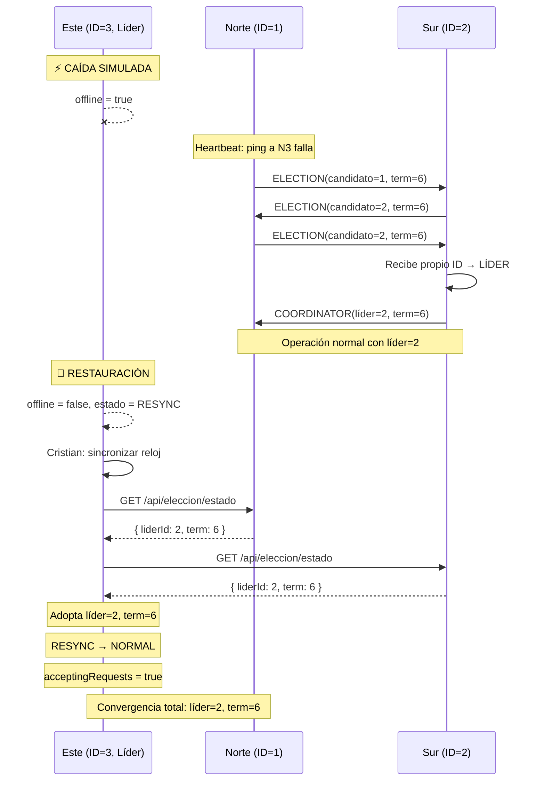

---

## 10. Matriz Consolidada

| Concepto SD | Componente responsable | Clase/Archivo clave | Endpoint de evidencia |
|---|---|---|---|
| Sincronización de reloj (Cristian) | Préstamos + API Gateway | `TimeController.java`, `PrestamoService.java` | `GET /api/time` |
| Exclusión mutua (Dekker V5) | Préstamos (simulación) | `DekkerSimulationController.java` | `GET /api/simulacion/dekker` |
| Exclusión mutua (Lock pesimista) | Préstamos + PostgreSQL | `LibroRepository.java` | `POST /api/prestamos/{id}` |
| Algoritmo de elección (Chang-Roberts) | Préstamos (anillo) | `LiderEleccionService.java` | `GET /api/eleccion/estado` |
| Tolerancia a fallas (Heartbeat) | Préstamos | `LiderEleccionService.verificarLider()` | `GET /api/eleccion/eventos` |
| Atenuación (Retry + Backoff) | Préstamos | `LiderEleccionService.solicitarAutorizacionInterSede()` | `GET /api/eleccion/eventos` |
| Atenuación (Balanceo round-robin) | API Gateway | `GatewayRoundRobinLoadBalancerConfig.java` | `GET /api/catalogo/instancia` |
| Comunicación HTTP/REST | Todos | Controladores REST | Todos los `/api/*` |
| Comunicación P2P (elección) | Préstamos | `LiderEleccionService.enviarAsync()` | `/api/eleccion/mensaje/*` |
| Descubrimiento dinámico | Eureka + clientes | Configuración Spring Cloud | Panel Eureka `:8761` |
| Recuperación de fallas (RESYNC) | Préstamos | `LiderEleccionService.resincronizarNodo()` | `POST /api/eleccion/resincronizar` |
| Persistencia de estado | Préstamos | `LiderEleccionService.guardarEstadoPersistido()` | `state/eleccion-state.properties` |
| Trazabilidad / observabilidad | Gateway + Préstamos | `GatewayRouteAuditFilter.java` | Headers `X-Gateway-Routed-Host` |

---

## 11. Conclusiones

### 11.1 Sincronización del reloj

El Algoritmo de Cristian permite obtener una marca temporal de referencia corregida por latencia de red, haciendo auditables los eventos de préstamo entre sedes con relojes divergentes. La telemetría de drift y RTT almacenada en cada préstamo proporciona evidencia verificable de la corrección aplicada.

### 11.2 Exclusión mutua

La combinación de una simulación académica (Dekker V5) con un mecanismo de producción (PESSIMISTIC_WRITE) permite tanto demostrar el concepto teórico como garantizar la consistencia real del inventario. El bloqueo pesimista en PostgreSQL serializa eficazmente el acceso concurrente al stock desde múltiples nodos distribuidos.

### 11.3 Algoritmos de elección

La implementación de Chang-Roberts en anillo lógico con épocas proporciona un mecanismo de coordinación dinámico que se adapta a cambios en la topología del sistema. El anillo se recalcula automáticamente desde Eureka, permitiendo agregar o retirar nodos sin reconfiguración manual.

### 11.4 Tolerancia a fallas

El sistema de heartbeat periódico con re-elección automática garantiza que la pérdida de un líder no deja al sistema sin coordinación de forma indefinida. La política de degradación selectiva permite que las operaciones locales continúen funcionando incluso durante la ventana de reelección.

### 11.5 Atenuación

El retry con backoff exponencial y el rollback transaccional automático minimizan el impacto de las fallas en las operaciones inter-sede. El balanceo round-robin distribuye la carga equitativamente y el filtrado de mensajes por época previene interferencias de elecciones obsoletas.

### 11.6 Comunicación

La arquitectura de tres capas de comunicación (externa vía Gateway, interna vía Eureka, y P2P para elección) proporciona flexibilidad, desacoplamiento y trazabilidad. El uso de nombres lógicos elimina dependencias estáticas de direcciones de red.

### 11.7 Recuperación de fallas

El protocolo de resincronización en tres fases (RESYNC → verificación → habilitación) garantiza que un nodo restaurado no participa en operaciones de negocio hasta converger con el estado actual del sistema, previniendo inconsistencias y split-brain.

### 11.8 Limitaciones y mejoras futuras

| Limitación actual | Mejora propuesta |
|---|---|
| Base de datos centralizada (SPOF) | Replicación multi-master o sharding por sede |
| Ventana sin líder para inter-sede (~5-8s) | Protocolo de consenso fuerte (Raft/Paxos) |
| Modelo de stock físico en 2 sedes | Extender a modelo de inventario dinámico multi-sede |
| Persistencia de estado de elección local | Persistencia distribuida del estado de liderazgo |
| Cobertura de pruebas automatizadas baja | Mayor cobertura de pruebas de carga y resiliencia |

---

## 12. Referencias Bibliográficas

1. Tanenbaum, A. S., & Van Steen, M. (2017). *Distributed Systems: Principles and Paradigms* (3rd ed.). Pearson.
2. Cristian, F. (1989). Probabilistic clock synchronization. *Distributed Computing*, 3(3), 146–158.
3. Lamport, L. (1978). Time, Clocks, and the Ordering of Events in a Distributed System. *Communications of the ACM*, 21(7), 558–565.
4. Chang, E., & Roberts, R. (1979). An improved algorithm for decentralized extrema-finding in circular configurations of processes. *Communications of the ACM*, 22(5), 281–283.
5. Dekker, T. J. (1965). Solution of a problem in concurrent programming control. En E. W. Dijkstra (Ed.), *EWD Manuscripts*.
6. Spring Boot Documentation. https://docs.spring.io/spring-boot/docs/current/reference/html/
7. Spring Cloud Gateway Documentation. https://docs.spring.io/spring-cloud-gateway/reference/
8. Spring Cloud LoadBalancer Documentation. https://docs.spring.io/spring-cloud-commons/reference/spring-cloud-commons/loadbalancer.html
9. Netflix Eureka (Spring Cloud Netflix). https://docs.spring.io/spring-cloud-netflix/docs/current/reference/html/
10. PostgreSQL Documentation. https://www.postgresql.org/docs/
11. Docker Documentation. https://docs.docker.com/

---

> **Nota de uso académico**: Este proyecto prioriza la demostrabilidad de conceptos de Sistemas Distribuidos en un entorno controlado de laboratorio. Para evolución a un entorno empresarial se requiere endurecimiento en seguridad, pruebas de resiliencia y un modelo de datos multi-sede completo.
