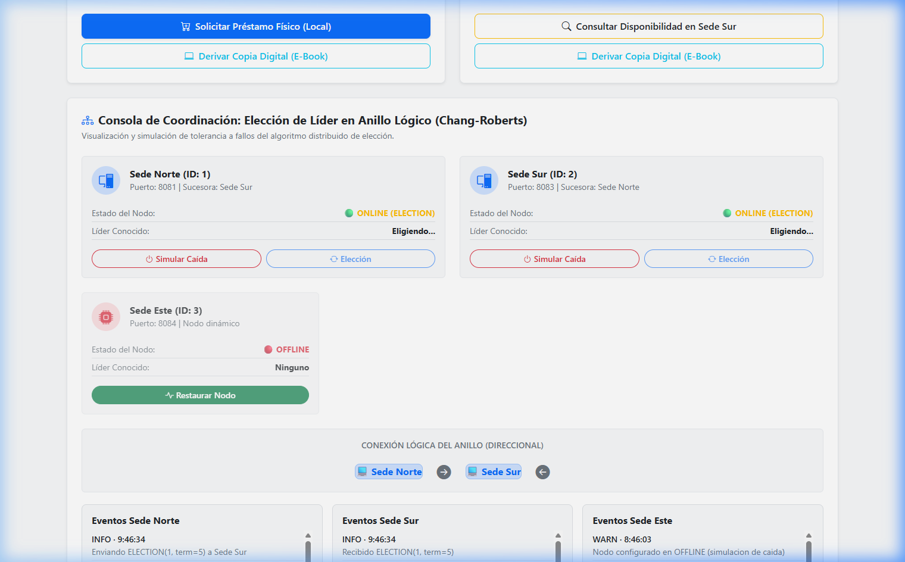
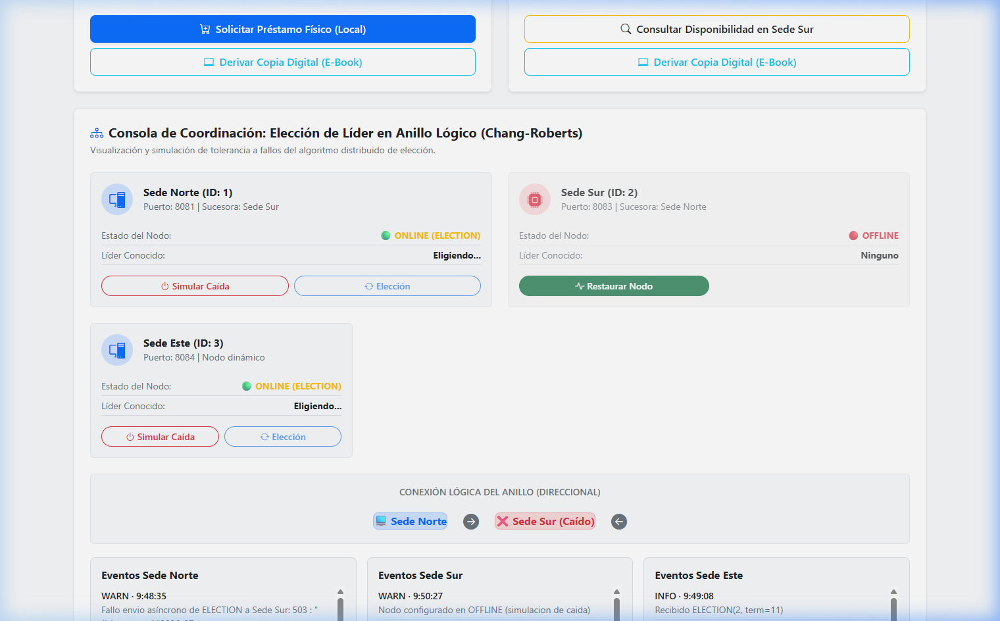
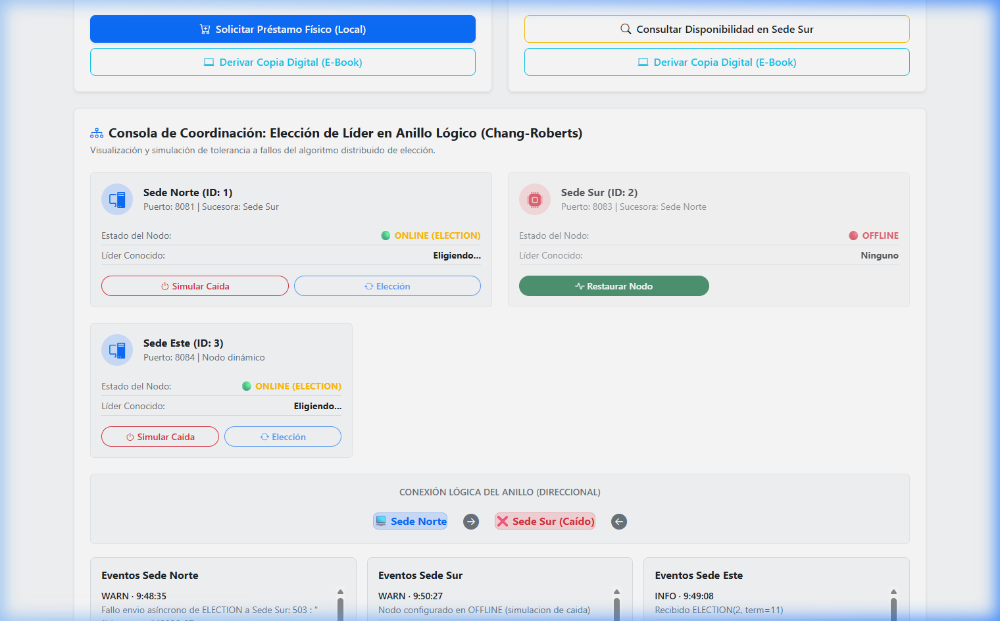
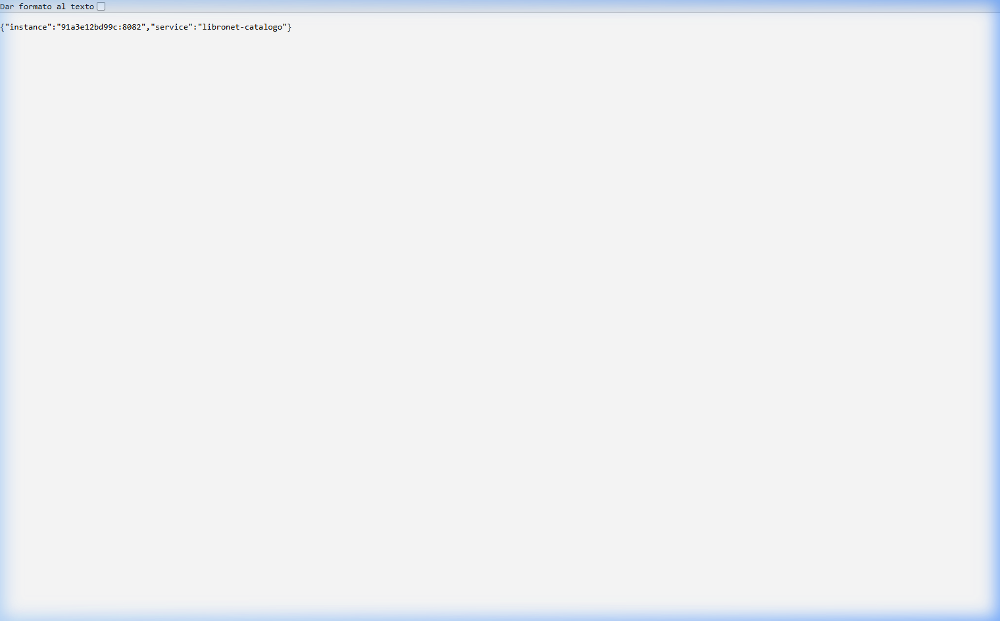
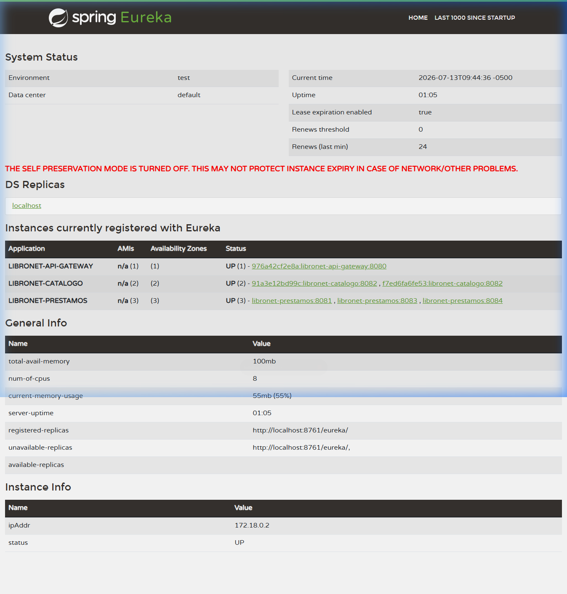
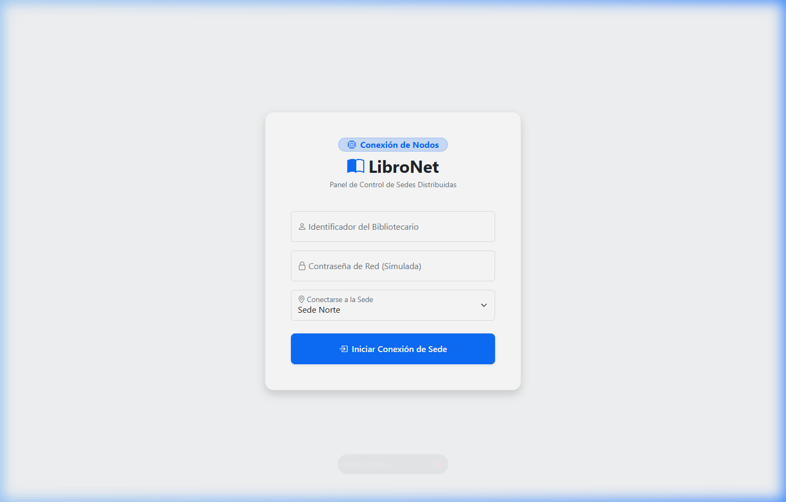
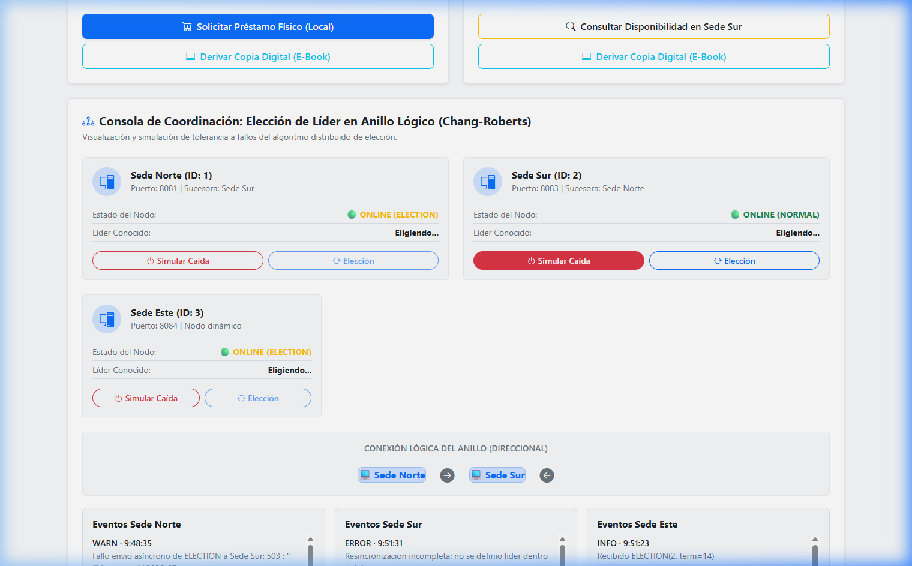

# 📚 Semana 17 - Exposición: Mecanismos de Coordinación y Tolerancia a Fallas en LibroNet

Este documento sirve como guía y evidencia visual para la sustentación/exposición de la **Semana 17** sobre los mecanismos distribuidos implementados en **LibroNet** (Sistema de Gestión Bibliotecaria Distribuido).

---

## 📋 Resumen de Temas y Evidencias Visuales

A continuación se detallan los 4 temas clave de la exposición, los conceptos teóricos asociados, qué capturas tomar y las capturas reales obtenidas del sistema en funcionamiento.

---

## 🔴 Tema 1: Introducción a Tolerancia a Fallas

### 1.1 Concepto
La **tolerancia a fallas** es la capacidad de LibroNet de seguir operando de manera correcta (posiblemente degradada) cuando uno o más de sus nodos o sedes sufren caídas.
En LibroNet se utiliza:
*   **Heartbeat (latido de corazón):** Cada nodo envía señales periódicas (cada 5 segundos) a su nodo sucesor en el anillo lógico para comprobar que sigue activo.
*   **Detección de Caída:** Si el sucesor no responde tras varios intentos, se detecta la falla del líder o del nodo.
*   **Elección de Líder (Algoritmo de Chang-Roberts):** Al detectarse la falla del líder, se inicia una elección a lo largo del anillo lógico de sedes (Norte, Sur, Este) para consensuar un nuevo líder sin intervención humana.

### 1.2 ¿Qué imágenes tomar para evidenciarlo?
1.  **Dashboard de control en estado NORMAL:** Muestra a todos los nodos conectados, el anillo lógico cerrado y un líder establecido.
2.  **Dashboard de control durante ELECTION (Simulación de Caída):** Captura el momento exacto en el que un nodo (por ejemplo, Sede Sur) se marca como `OFFLINE` y los nodos restantes cambian su estado a `ELECTION`, con el líder marcado como `-1` (sin líder temporal).
3.  **Dashboard de control con Nuevo Líder Elegido:** Muestra el anillo lógico reconfigurado y un nuevo nodo coronado como líder (por ejemplo, Sede Norte o Sede Este), demostrando que el sistema toleró la falla automáticamente.

### 1.3 Capturas del Sistema Real
*   **Pantalla 1: Estado Normal del Anillo y Líder Activo**
    
    *(Observar cómo todos los nodos están activos y hay un líder establecido).*

*   **Pantalla 2: Simulación de Caída y Estado de Elección**
    
    *(Se simula la caída de la Sede Sur; su estado cambia a `OFFLINE` y el resto de nodos entra en proceso de re-elección).*

*   **Pantalla 3: Auto-recuperación y Nuevo Líder Coronado**
    
    *(El sistema converge automáticamente y corona a un nuevo líder estable sin intervención manual).*

---

## 🟡 Tema 2: Atenuación (Mitigación)

### 2.1 Concepto
La **atenuación** (*mitigation*) consiste en técnicas para **minimizar el impacto** de una falla y evitar que afecte al usuario final, manteniendo el servicio activo (incluso si está degradado).
En LibroNet implementamos:
1.  **Balanceo de Carga Round-Robin:** El API Gateway distribuye de forma equitativa las peticiones entre réplicas del servicio de Catálogo. Si una réplica se congestiona o cae, el tráfico se redirige a la otra.
2.  **Retry con Backoff Exponencial:** Ante fallas de comunicación temporales, los servicios reintentan la conexión espaciando los intentos de manera exponencial (300ms → 600ms → 1200ms → 2000ms) para no saturar la red ni los nodos en recuperación.
3.  **Rollback Transaccional:** Si una operación distribuida (como un préstamo inter-sede) falla tras agotar los reintentos, se ejecuta un rollback automático para restaurar el stock local y mantener la consistencia.

### 2.2 ¿Qué imágenes tomar para evidenciarlo?
1.  **Peticiones consecutivas al servicio de catálogo:** Capturar la respuesta JSON del gateway en `/api/catalogo/instancia` que demuestra el cambio alterno de los identificadores de instancia del contenedor Docker.
2.  **Logs o historial de eventos con Backoff Exponencial:** Capturar el bloque de reintentos mostrando los intervalos de tiempo incrementales.

### 2.3 Capturas del Sistema Real
*   **Pantalla 4: Evidencia de Balanceo de Carga (Round-Robin)**
    
    *(Al realizar peticiones consecutivas al gateway, este nos devuelve una instancia del servicio de catálogo diferente, demostrando la distribución de carga para atenuar sobrecargas).*

---

## 🟢 Tema 3: Comunicación

### 3.1 Concepto
La **comunicación distribuida** coordina los diferentes microservicios de LibroNet mediante un esquema híbrido:
1.  **Comunicación Externa (Cliente-Servidor):** El Frontend se comunica únicamente con el **API Gateway** en el puerto `8080` (punto único de entrada).
2.  **Descubrimiento Dinámico de Servicios (Eureka):** Los servicios (Catálogo, Préstamos) se registran dinámicamente en el servidor Eureka (`8761`). No se utilizan IPs fijas; los servicios se descubren usando sus nombres lógicos (ej. `LIBRONET-CATALOGO`).
3.  **Comunicación Peer-to-Peer (P2P) Directa:** Durante la elección de líder y el envío de heartbeats, los nodos del servicio de préstamos se comunican directamente en anillo lógico sin pasar por el Gateway, acelerando el consenso.
4.  **Trazabilidad mediante Headers:** Se inyectan headers como `X-Gateway-Routed-Host` y `X-LibroNet-Instance` en las respuestas HTTP para rastrear qué nodo físico procesó la transacción.

### 3.2 ¿Qué imágenes tomar para evidenciarlo?
1.  **Dashboard de Eureka Service Registry:** Muestra la lista de microservicios registrados dinámicamente con sus respectivas instancias y estados de salud.
2.  **Pantalla de Login del Frontend:** Muestra el panel de control conectándose al nodo a través del Gateway.
3.  **Headers de respuesta HTTP (en el inspector de red F12):** Demuestra el enrutamiento dinámico del Gateway y la trazabilidad del nodo origen.

### 3.3 Capturas del Sistema Real
*   **Pantalla 5: Eureka Service Registry Dashboard**
    
    *(Aquí se visualizan todos los microservicios activos registrados automáticamente: el gateway, 2 réplicas de catálogo y las 3 sedes de préstamos).*

*   **Pantalla 6: Interfaz de Login y Conexión de Sede**
    
    *(El panel inicial que permite establecer la conexión de red simulada hacia la sede elegida usando HTTP/REST a través del Gateway).*

---

## 🔵 Tema 4: Recuperación de Fallas (Failure Recovery)

### 4.1 Concepto
La **recuperación de fallas** es el proceso por el cual un nodo previamente caído se reincorpora al sistema distribuido de forma consistente.
En LibroNet, esto se realiza mediante el protocolo de **RESYNC** que consta de 3 fases:
1.  **Fase 1: Sincronización Temporal (Algoritmo de Cristian):** El nodo recuperado contacta al API Gateway para obtener la hora exacta del sistema, calculando el RTT/2 para compensar la latencia de red.
2.  **Fase 2: Sincronización del Anillo:** El nodo consulta a Eureka y a los nodos vecinos para reconstruir el estado actual del anillo, la época (epoch) de la última elección y quién es el líder vigente.
3.  **Fase 3: Habilitación Gradual:** Durante el proceso de resincronización, el nodo entra en estado temporal `RESYNC` y tiene `acceptingRequests=false` (rechaza peticiones de negocio para evitar inconsistencias). Una vez sincronizado, pasa a estado `NORMAL` y establece `acceptingRequests=true`.

### 4.2 ¿Qué imágenes tomar para evidenciarlo?
1.  **Dashboard del Nodo en estado RESYNC:** Captura el estado temporal del nodo justo después de restaurarlo (debe mostrar `estadoNode="RESYNC"` y `acceptingRequests=false`).
2.  **Dashboard del Nodo restaurado en estado NORMAL:** Muestra la reincorporación exitosa al anillo lógico con `estadoNode="NORMAL"`, `acceptingRequests=true` y el líder correctamente adoptado.

### 4.3 Capturas del Sistema Real
*   **Pantalla 7: Nodo Reincorporado y Restauración Completada**
    
    *(Tras hacer clic en "Restaurar Nodo", la Sede Sur pasa de `OFFLINE` a `RESYNC` donde sincroniza su reloj y época, para finalmente volver al estado `NORMAL` con `acceptingRequests=true` y reconocer al líder actual).*

---

## 🚀 Resumen del Flujo para la Exposición en Vivo (5-7 minutos)

Si vas a exponer este tema ante el jurado o docente, te sugerimos seguir este orden:

1.  **Inicio (Comunicación):** Muestra el panel de **Eureka (Pantalla 5)** para explicar que LibroNet es una arquitectura de microservicios distribuidos autodescubiertos.
2.  **Uso de la App (Atenuación):** Loguéate en el **Frontend (Pantalla 6)**, activa el **Modo Auditoría** y haz búsquedas rápidas. Explica que el Gateway realiza balanceo Round-Robin **(Pantalla 4)** para atenuar sobrecargas.
3.  **Falla (Tolerancia a Fallas):** Muestra el panel de coordinación en estado normal **(Pantalla 1)**. Luego, simula la caída de la Sede Sur **(Pantalla 2)**. Explica cómo los otros nodos detectan la ausencia del heartbeat y disparan el algoritmo de Chang-Roberts. Muestra cómo se elige un nuevo líder **(Pantalla 3)** sin intervención manual.
4.  **Retorno (Recuperación):** Haz clic en "Restaurar Nodo" para la Sede Sur. Explica el protocolo **RESYNC (Fases de sincronización de reloj Cristian y anillo)**. Muestra cómo el nodo vuelve exitosamente al estado normal y adopta al líder actual de forma consistente **(Pantalla 7)**.

---
**Última revisión:** Julio 2026  
**Proyecto:** LibroNet - Biblioteca Distribuida  
**Curso:** Sistemas Distribuidos  
