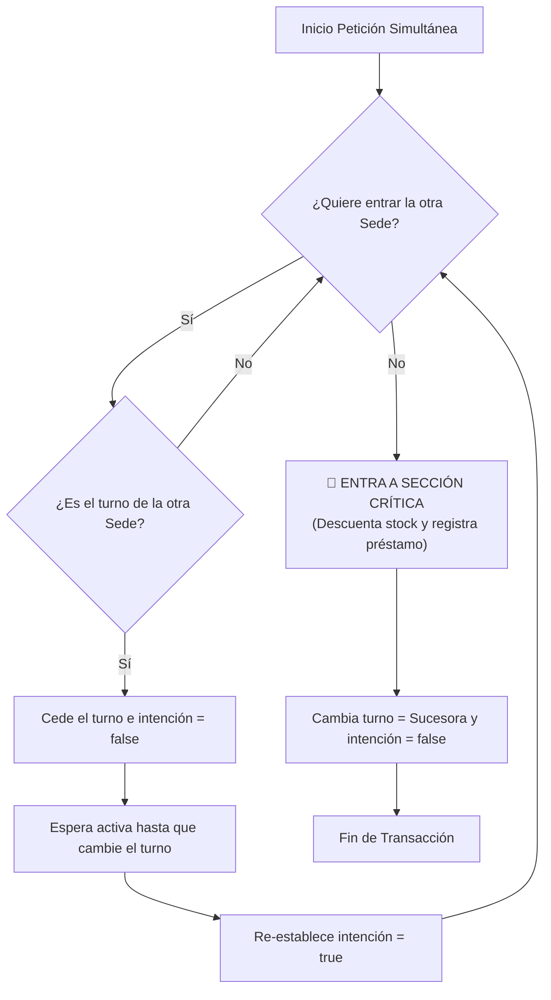

# Informe de Avance Semanal — Semana 13: Exclusión Mutua (BiblioNet)

---

## 1. Objetivo del avance semanal
**¿Qué se buscó lograr esta semana y qué parte del proyecto fue trabajada?**

- Diseñar e implementar mecanismos de **Exclusión Mutua** en el clúster de BiblioNet para garantizar que las sedes (Norte y Sur) no generen colisiones al prestar simultáneamente la última copia física de un libro.
- Implementar y demostrar de forma interactiva el **Algoritmo de Dekker (Versión 5)** en su versión académica para 2 procesos concurrentes mediante simulación de hilos.
- Asegurar la consistencia estricta en el entorno transaccional real de base de datos aplicando bloqueos concurrentes pesimistas.

---

## 2. Descripción técnica del avance
**Explicar técnicamente el avance realizado. Incluir componentes, servicios, nodos, módulos, decisiones de diseño o implementación.**

- **Simulador de Algoritmo de Dekker V5**: Se creó el controlador `DekkerSimulationController.java` expuesto en `/api/simulacion/dekker`. Simula la colisión de peticiones concurrentes de préstamo sobre un libro con stock de 1 unidad. Usa variables booleanas `volatile` (`quiereEntrarSedeNorte`, `quiereEntrarSedeSur`) y un `turno` compartido en memoria. Esto asegura la exclusión mutua en la JVM impidiendo que ambos hilos accedan al stock al mismo tiempo.
- **Bloqueo Pesimista en Base de Datos (Producción)**: Para las transacciones reales en producción distribuidas por el Gateway, se implementó en `PrestamoService` un bloqueo pesimista en la consulta SQL utilizando Spring Data JPA:
  ```java
  @Lock(LockModeType.PESSIMISTIC_WRITE)
  ```
  Esto traduce a una consulta `SELECT FOR UPDATE` en PostgreSQL, bloqueando la fila correspondiente al libro y forzando a que la otra sede espere hasta que finalice la transacción del préstamo en curso, asegurando exclusión mutua transaccional.

---

## 3. Relación con Sistemas Distribuidos
**Explicar qué concepto del curso se aplicó.**

- **Exclusión Mutua**: Controlar el acceso al recurso compartido crítico (el stock físico de ejemplares del catálogo) para evitar condiciones de carrera (*race conditions*).
- **Consistencia Transaccional (ACID)**: Asegurar que el stock nunca sea menor a 0. Las transacciones se aíslan de modo que operaciones simultáneas sobre el mismo registro se serialicen mediante bloqueos en la base de datos distribuida.

---

## 4. Evidencias del avance
**Diagramas, capturas sugeridas, código relevante y tabla de enrutamiento.**

### A. Diagrama de Sección Crítica y Dekker


### B. Fragmento de Código Clave (Dekker V5 en Java)
```java
// Hilo de la Sede Sur intentando ingresar
Thread sedeSur = new Thread(() -> {
    quiereEntrarSedeSur = true;

    while (quiereEntrarSedeNorte) {
        if (turno == 1) { // Si el turno es del rival (Norte = 1)
            quiereEntrarSedeSur = false; // Cede la intención
            while (turno == 1) {
                // Espera activa cediendo la CPU
            }
            quiereEntrarSedeSur = true; // Re-declara intención
        }
    }

    // --- SECCIÓN CRÍTICA ---
    if (inventarioSimulado > 0) {
        inventarioSimulado--; // Acceso exclusivo al recurso
    }
    // --- FIN SECCIÓN CRÍTICA ---

    turno = 1; // Cede el turno a la Sede Norte
    quiereEntrarSedeSur = false; // Libera intención
});
```

### C. Capturas Sugeridas para la Presentación
1. **📸 Captura 1: Búsqueda del Libro a Prestar**:
   - Muestra la pantalla del catálogo con un libro con **stock = 1**.
2. **📸 Captura 2: Simulación de Dekker (Consola/API)**:
   - Realiza un `GET` a `/api/simulacion/dekker`. Muestra la bitácora de eventos devuelta por el JSON donde se ve cómo un hilo entra a la sección crítica mientras el otro espera su turno, impidiendo la sobreventa.
3. **📸 Captura 3: Bloqueo Pesimista en Consola de Spring Boot**:
   - Captura los logs del contenedor del microservicio de préstamos donde se visualice la instrucción SQL `select ... for update` ejecutada por Hibernate durante un préstamo, mostrando cómo se serializan las peticiones en producción.

---

## 5. Problemas encontrados
**Dificultades técnicas y limitaciones.**

1. **Visibilidad en Caché de CPU (JVM)**: En las primeras pruebas de simulación de Dekker, los hilos entraban en bucles infinitos o no respetaban el turno. Esto ocurría porque la JVM mantenía en caché las variables de estado y no sincronizaba inmediatamente los cambios entre los diferentes núcleos del procesador.
2. **Inanición (Starvation) y Deadlock**: Las versiones 1 a 4 del Algoritmo de Dekker presentaban escenarios de bloqueo mutuo donde ambos procesos declaraban la intención simultáneamente y ninguno permitía avanzar al otro.

---

## 6. Soluciones implementadas
**Acciones correctivas.**

1. **Uso de la Palabra Clave `volatile`**: Se declararon las variables de estado `quiereEntrarSedeNorte`, `quiereEntrarSedeSur` y `turno` con la anotación `volatile`. Esto obliga a la JVM a leer y escribir directamente en la memoria RAM principal, asegurando visibilidad inmediata de la exclusión mutua entre hilos.
2. **Implementación de Dekker Versión 5**: Se programó la quinta versión del algoritmo, la cual introduce un mecanismo de retroceso voluntario: si hay conflicto de intención y no es su turno, el nodo desactiva temporalmente su bandera de intención para permitir que el otro proceso avance, solucionando la inanición.
3. **Bloqueo Pesimista de Base de Datos**: Como Dekker en memoria es una simulación académica para hilos de un único proceso y no escala en clústeres reales multi-nodo, se aplicó un bloqueo pesimista en PostgreSQL (`SELECT FOR UPDATE`), trasladando la exclusión mutua a la capa de datos.

---

## 7. Próximos pasos
**Planificación para el siguiente sprint.**

- Escalar el sistema implementando un Servidor de Tiempo Central en el Gateway utilizando el **Algoritmo de Cristian** para sincronizar relojes de préstamo.
- Diseñar un mecanismo dinámico de **Elección de Líder** mediante un clúster Eureka para coordinar de forma automatizada las sedes cuando existan caídas.

---

## 8. Participación / aporte

| Integrante | Rol | Aporte Principal | Evidencia / Commit |
|------------|-----|------------------|--------------------|
| **Rosales Alvarez, Kevin** | Coordinador | Lideró la planificación de la semana y supervisó la simulación del Dekker. | Acta de reunión y seguimiento. |
| **Paredes Merino, Zahid** | Arquitecto de solución | Diseñó el modelo lógico de la sección crítica e identificó la necesidad del bloqueo pesimista. | Diagrama UML de exclusión mutua. |
| **Olivares Chavez, Jeremi** | Responsable de implementación | Desarrolló el código del simulador de Dekker V5 y la consulta JPA pesimista. | Commit: "Exclusion Mutua" (`1c7bae9`). |
| **Martinez Esparza, Samuel Fabrizio** | Responsable de documentación | Redactó la documentación técnica inicial sobre concurrencia y Dekker. | Documentación en `readme.md`. |
| **Cortez Pacheco, Angelo Jesus** | Responsable de exposición y QA | Simuló los accesos simultáneos y probó la consistencia transaccional del sistema. | Casos de prueba de sobreventa concurrente. |

---

## 9. Checklist antes de entregar

| Verificación | Detalle | Cumple |
|---|---|---|
| **Ítem 1** | El documento indica semana, tema, grupo, integrantes y roles. | **Sí** |
| **Ítem 2** | Se explica claramente el avance técnico realizado. | **Sí** |
| **Ítem 3** | Se evidencia la relación con Sistemas Distribuidos. | **Sí** |
| **Ítem 4** | Se incluyen capturas sugeridas, diagramas, código y evidencia. | **Sí** |
| **Ítem 5** | Se registran problemas encontrados y acciones correctivas. | **Sí** |
| **Ítem 6** | El documento está redactado de manera formal y ordenada. | **Sí** |
