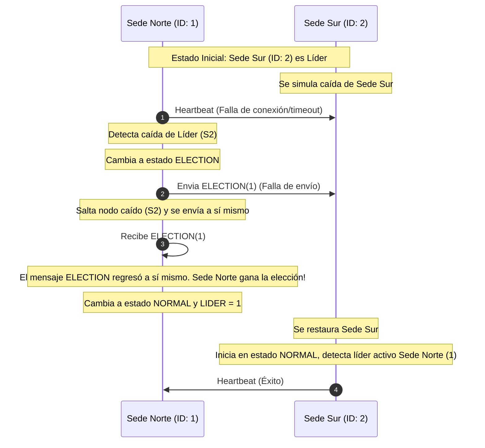

# Informe de Avance Semanal — Semana 14: Elección de Líder (BiblioNet)

---

## 1. Objetivo del avance semanal
**¿Qué se buscó lograr esta semana y qué parte del proyecto fue trabajada?**

- Diseñar e implementar un mecanismo automatizado de **Elección de Líder** (Algoritmo en Anillo Lógico) dentro de la arquitectura distribuida de **BiblioNet**.
- Asegurar la **alta disponibilidad** y la **tolerancia a fallos** del sistema. Si el nodo encargado de funciones críticas (coordinador) se cae, las sedes activas eligen dinámicamente un nuevo líder sin intervención manual.

---

## 2. Descripción técnica del avance
**Explicar técnicamente el avance realizado. Incluir componentes, servicios, nodos, módulos, decisiones de diseño o implementación.**

- **Algoritmo de Elección en Anillo Lógico (Chang-Roberts)**: Se optó por un algoritmo en anillo donde cada nodo de la biblioteca (`prestamos-service`) tiene un identificador único (`node-id` = 1 para Sede Norte, `node-id` = 2 para Sede Sur).
- **Descubrimiento y Formación Dinámica del Anillo**: Los nodos se registran en Netflix Eureka con su ID en los metadatos (`eureka.instance.metadata-map.nodeId`). Dinámicamente, consultan Eureka, obtienen todas las instancias activas del servicio, las ordenan por ID ascendente para formar un anillo lógico circular y calculan su sucesor inmediato.
- **Detección de Caídas por Heartbeat**: Los nodos seguidores realizan un control de salud periódico (cada 5 segundos) al líder. Si el líder no responde (o no hay líder configurado), se inicia una elección enviando un mensaje `ELECTION(candidateId)` a su sucesor.
- **Omisión de Nodos Fallidos**: Al enviar mensajes de elección o coordinador, si el sucesor directo no responde debido a una caída, el nodo emisor lo salta y envía el mensaje al siguiente sucesor en el anillo lógico, garantizando la tolerancia a fallos.
- **Simulación en Caliente y Consola de Control**: Se crearon endpoints en `/api/eleccion` y una interfaz de control en el frontend (React) bajo el "Modo Auditoría" para monitorizar el anillo, forzar elecciones y simular la caída/recuperación en caliente de cada sede (retornando HTTP 503 cuando está caída).

---

## 3. Relación con Sistemas Distribuidos
**Explicar qué concepto del curso se aplicó.**

- **Coordinación Distribuida (Elección de Líder)**: Resuelve el problema de centralizar decisiones críticas (como aprobación de préstamos inter-sedes) en un entorno descentralizado eligiendo un coordinador único de manera consensuada.
- **Tolerancia a Fallos**: El algoritmo maneja la caída del líder reorganizando el anillo lógico de forma automática.
- **Descubrimiento de Servicios (Direccionamiento)**: Se aplica direccionamiento dinámico con Eureka, eliminando IPs o puertos quemados en la configuración.

---

## 4. Evidencias del avance
**Diagramas, capturas sugeridas, código relevante y tabla de enrutamiento.**

### A. Diagrama de Flujo del Algoritmo (Chang-Roberts)


### B. Fragmento de Código Clave (`LiderEleccionService.java`)
```java
// Procesamiento de mensaje ELECTION
public synchronized void procesarMensajeEleccion(int candidateId) {
    if (isOffline) throw new RuntimeException("Nodo caído");

    if (candidateId > this.nodeId) {
        this.estadoNode = "ELECTION";
        this.liderId = -1;
        enviarMensajeEleccion(candidateId); // Reenviar ID superior
    } else if (candidateId < this.nodeId) {
        if ("NORMAL".equals(this.estadoNode)) {
            this.estadoNode = "ELECTION";
            this.liderId = -1;
            enviarMensajeEleccion(this.nodeId); // Introducir mi ID superior
        }
    } else {
        // candidateId == nodeId: Ganamos la elección
        declararLider();
    }
}
```

### C. Capturas Sugeridas para la Presentación
1. **📸 Captura 1: Estado Inicial Estable**:
   - Muestra el frontend en **Modo Auditoría**.
   - Evidencia que ambos nodos están ONLINE y **Sede Sur (ID: 2)** es el **Líder Actual** por tener el mayor ID.
2. **📸 Captura 2: Simulación de Fallo del Líder**:
   - Da clic en **Simular Caída** en la Sede Sur (ID: 2).
   - Observa que el estado de Sede Sur cambia a **OFFLINE (Rojo)**.
3. **📸 Captura 3: Failover y Reelección Automática**:
   - Pasados 5 segundos (siguiente ciclo de monitoreo), visualiza cómo **Sede Norte (ID: 1)** detecta la caída, realiza la elección en anillo omitiendo a Sede Sur y se auto-proclama **Líder Actual (Verde)**.
4. **📸 Captura 4: Auto-recuperación (Self-Healing)**:
   - Da clic en **Restaurar Nodo** en Sede Sur.
   - Evidencia que Sede Sur vuelve a estar ONLINE, reconoce a Sede Norte como líder y el anillo lógico se re-sincroniza sin afectar el servicio.

---

## 5. Problemas encontrados
**Dificultades técnicas y limitaciones.**

1. **Balanceo de Carga RestTemplate**: Spring Boot inyecta por defecto un `RestTemplate` configurado con `@LoadBalanced` (que usa round-robin sobre Eureka). Si usábamos este cliente para pasar mensajes en anillo, era imposible llamar a un nodo específico (el sucesor), ya que el balanceador de carga redirigía la petición aleatoriamente.
2. **Demora del Registro de Eureka**: Cuando un contenedor Docker de una sede se detiene por completo, Eureka tarda entre 30 a 90 segundos en removerlo de la lista activa. Esto causa retrasos en la reorganización del anillo.

---

## 6. Soluciones implementadas
**Acciones correctivas.**

1. **Cliente Directo**: Se instanció un `RestTemplate` secundario sin la anotación `@LoadBalanced` (`this.directRestTemplate = new RestTemplate()`) dentro del servicio de elección para poder enviar peticiones HTTP dirigidas específicamente a la URI exacta del contenedor del sucesor.
2. **Heartbeat y Failover Proactivo en Anillo**: En lugar de depender de que Eureka notifique la caída del nodo, el algoritmo intenta conectarse directamente al sucesor. Si se produce un `IOException` o timeout en el socket, el nodo emisor asume la caída al instante, actualiza su lista interna de forma proactiva, y salta al siguiente nodo disponible.
3. **Rutas Dedicadas en API Gateway**: Se añadieron rutas específicas en el Gateway (`/api/eleccion/norte/**` y `/api/eleccion/sur/**`) con reescritura de URL (`RewritePath`) para poder dirigir peticiones de administración individuales a cada nodo desde el navegador.

---

## 7. Próximos pasos
**Planificación para el siguiente sprint.**

- Extender la Elección de Líder para coordinar la replicación de transacciones y consistencia del catálogo en bases de datos locales si se simula una desconexión total.
- Implementar un algoritmo de Exclusión Mutua distribuido basado en Token Ring usando este mismo anillo lógico establecido por el líder.

---

## 8. Participación / aporte

| Integrante | Rol | Aporte Principal | Evidencia / Commit |
|------------|-----|------------------|--------------------|
| **Rosales Alvarez, Kevin** | Coordinador | Lideró la planificación y supervisó la integración del Algoritmo de Elección. | Plan de pruebas semanal. |
| **Paredes Merino, Zahid** | Arquitecto de solución | Diseñó el modelo lógico del anillo distribuido y las rutas en el Gateway. | Modificación en `application.yml` del Gateway. |
| **Olivares Chavez, Jeremi** | Responsable de implementación | Desarrolló el servicio Java del algoritmo en anillo (Chang-Roberts) y endpoints REST. | Commits en `LiderEleccionService` y `EleccionController`. |
| **Martinez Esparza, Samuel Fabrizio** | Responsable de documentación | Redactó el informe semanal y actualizó la documentación técnica del anillo lógico. | Redacción de `informe_semana14.md` y `readme.md`. |
| **Cortez Pacheco, Angelo Jesus** | Responsable de exposición y QA | Simuló los escenarios de failover, caída en caliente de nodos y validó la respuesta del frontend. | Casos de prueba de caídas en caliente. |

---

## 9. Checklist antes de entregar

| Verificación | Detalle | Cumple |
|---|---|---|
| **Ítem 1** | El documento indica semana, tema, grupo, integrantes y roles. | **Sí** |
| **Ítem 2** | Se explica claramente el avance técnico realizado. | **Sí** |
| **Ítem 3** | Se evidencia la relación con Sistemas Distribuidos. | **Sí** |
| **Ítem 4** | Se incluyen capturas sugeridas, diagramas, código y evidencia. | **Sí** |
| **Ítem 5** | Se registran problemas encontrados y acciones correctivas. | **Sí** |
| **Ítem 6** | El documento está redactado de manera formal y ordenada. | **Sí** |
