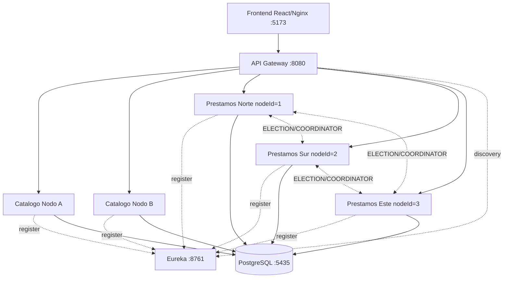

# Informe de Avance Semanal - Semana 14: Liderazgo, Fallas y Escalabilidad (BiblioNet)

## 1. Objetivo del avance semanal

- Cerrar la brecha entre lo prometido en el informe y lo demostrado por el codigo ejecutable.
- Fortalecer evidencia de balanceo, tolerancia a fallos, recuperacion y escalabilidad.
- Dejar trazabilidad visual en frontend para sustentacion.

## 2. Arquitectura distribuida

```mermaid
graph TD
    FE[Frontend React/Nginx :5173]
    GW[API Gateway :8080]
    EU[Eureka :8761]
    CAT1[Catalogo Nodo A]
    CAT2[Catalogo Nodo B]
    PN[Prestamos Norte nodeId=1]
    PS[Prestamos Sur nodeId=2]
    PE[Prestamos Este nodeId=3]
    DB[(PostgreSQL :5435)]

    FE --> GW
    GW --> CAT1
    GW --> CAT2
    GW --> PN
    GW --> PS
    GW --> PE

    GW -.discovery.-> EU
    CAT1 -.register.-> EU
    CAT2 -.register.-> EU
    PN -.register.-> EU
    PS -.register.-> EU
    PE -.register.-> EU

    CAT1 --> DB
    CAT2 --> DB
    PN --> DB
    PS --> DB
    PE --> DB

    PN <-. ELECTION/COORDINATOR .-> PS
    PS <-. ELECTION/COORDINATOR .-> PE
    PE <-. ELECTION/COORDINATOR .-> PN
```

## 3. Evidencia de balanceo round-robin

Implementado:
- Politica explicita de `RoundRobinLoadBalancer` en gateway.
- Dos instancias del `catalogo-service` registradas con el mismo nombre logico en Eureka.
- Header de auditoria `X-Gateway-Routed-Host` para evidenciar host:puerto destino.
- Header de microservicio `X-LibroNet-Instance` en respuestas para verificar instancia servidora.
- Endpoints de validacion:
  - `GET /api/catalogo/instancia`
  - `GET /api/prestamos/instancia`

Demostracion sugerida:
- Ejecutar 10 requests seguidos a `/api/catalogo/instancia`.
- Observar alternancia de instancias en headers/logs (round-robin).

## 4. Tolerancia a fallos y recuperacion

## 4.1 Politica ante transacciones en vuelo (lider cae)

Se definio e implemento politica de **retry con backoff + rollback**:
1. Prestamo inter-sede pide autorizacion al lider.
2. Si falla, reintenta automaticamente (backoff exponencial).
3. Si se detecta lider no disponible, dispara nueva eleccion.
4. Reintenta contra lider actualizado.
5. Si agota intentos, falla la operacion y se hace rollback transaccional.

Resultado:
- No hay confirmacion parcial de prestamos inter-sede.
- El sistema no "acepta por defecto" sin coordinador valido.

## 4.2 Reincorporacion de nodo

Al restaurar `offline=false`:
- El nodo entra en `RESYNC`.
- No acepta peticiones de negocio (`acceptingRequests=false`).
- Sincroniza reloj por Cristian consultando `/api/time`.
- Revisa anillo/termino/lider.
- Si no hay lider vigente, inicia eleccion.
- Al converger, habilita aceptacion de peticiones.

Endpoint nuevo:
- `POST /api/eleccion/resincronizar`

## 4.3 Persistencia del estado de eleccion

Se implemento persistencia local de:
- `liderId`
- `liderazgoEpoca`
- `estadoNode`
- `acceptingRequests`
- `lastClockSyncMs`

Archivo:
- `state/eleccion-state.properties`

Comportamiento esperado:
- Reinicio del proceso: intenta recuperar estado previo.
- Si el estado recuperado no coincide con el anillo activo: heartbeat/eleccion corrigen convergencia.
- Re-creacion del contenedor: puede perderse estado y re-elegirse desde cero.

## 4.4 Historial visual de recuperacion en frontend

Se agrego en modo auditoria:
- Timeline de eventos por nodo (`/api/eleccion/eventos`).
- Eventos de caida detectada, ELECTION, COORDINATOR, lider electo, resincronizacion y reincorporacion.

## 5. Escalabilidad (nuevo nodo dinamico)

Se agrego nodo:
- `prestamos-este` con `nodeId=3`.

Propiedad demostrada:
- El anillo se recalcula dinamicamente desde Eureka sin reconfiguracion manual.
- Se soporta alta/baja de nodos y recalculo de sucesor en runtime.

## 6. Modulo de seguridad (coherente con codigo)

Decision final documentada:
- El sistema usa autenticacion real contra tabla `bibliotecario`.
- Passwords verificadas con BCrypt.
- No se usan credenciales hardcoded para login en backend.

Endpoint:
- `POST /api/auth/login`

## 7. Operaciones dependientes del lider (SPOF logico)

Dependen del lider:
- `autorizar-prestamo-inter-sede`

No dependen del lider:
- Prestamos locales
- Prestamos digitales
- Busqueda de catalogo

Ventana sin lider:
- Deteccion por heartbeat: hasta 5s.
- Reeleccion + propagacion: tipicamente sub-segundos a pocos segundos.
- Ventana total esperada de no-autorizacion inter-sede: aproximadamente 5 a 8s.

Politica de degradacion elegida:
- Permitir operaciones locales y digitales.
- Bloquear/reintentar unicamente operaciones inter-sede hasta coordinador valido.

Justificacion de diseno (lider vs consenso tipo Raft):
- Se privilegio simplicidad y demostrabilidad academica (anillo logico).
- Trade-off asumido: disponibilidad reducida en la ruta inter-sede durante ventana sin lider.
- Raft/quorum incrementaria complejidad de implementacion/operacion para el alcance actual.

## 8. Casos de uso completos

## CU-1: Prestamo fisico con stock local

Actor:
- Bibliotecario

Flujo principal:
1. Busca libro en catalogo.
2. Solicita prestamo fisico.
3. Servicio aplica lock pesimista del libro.
4. Verifica stock local y descuenta.
5. Sincroniza tiempo (Cristian) y registra transaccion.
6. Responde `ENTREGADO`.

Flujos alternativos:
- Libro no existe -> rechazo.
- Nodo en OFFLINE/RESYNC -> 503.

Relacion con SD:
- Exclusión mutua y consistencia transaccional.

## CU-2: Prestamo inter-sede con autorizacion de lider

Actor:
- Bibliotecario solicitante

Flujo principal:
1. Solicita prestamo sin stock local.
2. Se detecta stock remoto.
3. Nodo consulta al lider para autorizacion.
4. Lider autoriza.
5. Se descuenta stock remoto.
6. Se registra `PENDIENTE_DE_ENVIO`.

Flujos alternativos:
- Lider cae durante autorizacion -> retry con backoff + reeleccion.
- Sin lider tras reintentos -> rollback y rechazo.

Relacion con SD:
- Coordinacion por lider, tolerancia a fallos y recuperacion.

## CU-3: Caida de nodo y re-eleccion durante prestamo en curso

Actor:
- Sistema distribuido + bibliotecario

Flujo principal:
1. Se inicia prestamo inter-sede.
2. Lider cae en medio del proceso.
3. Nodos detectan falla por heartbeat.
4. Se ejecuta eleccion en anillo.
5. Nuevo lider asume coordinacion.
6. Nodo recuperado ejecuta resincronizacion.
7. Nodo recuperado vuelve como follower coherente.

Flujos alternativos:
- Resincronizacion no converge en timeout -> nodo sigue sin aceptar negocio.
- Mensajes con termino obsoleto -> se descartan para evitar split-brain.

Relacion con SD:
- Failover, reconfiguracion dinamica y convergencia post-falla.

## 9. Pruebas para el informe

Caso 1: caida del lider con prestamo inter-sede pendiente de autorizacion
1. Preparar libro con stock solo remoto.
2. Iniciar solicitud inter-sede.
3. Simular caida del lider durante autorizacion.
4. Verificar en eventos: retry, election, coordinator.
5. Verificar resultado consistente: exito autorizado o rollback limpio.

Caso 2: caida y reincorporacion del mismo nodo (anti split-brain)
1. Caer nodo lider.
2. Confirmar nuevo coordinador en nodos restantes.
3. Restaurar nodo caido.
4. Ejecutar/confirmar resincronizacion.
5. Verificar lider unico convergente en todos los `/estado`.

## 10. Conclusiones

- Se paso de una demo de eleccion basica a un flujo robusto con retry, resync, persistencia de estado y trazabilidad visual.
- La arquitectura ahora demuestra de forma verificable balanceo, tolerancia a fallos y escalamiento dinamico.
- Se documentaron explicitamente dependencias del lider y trade-offs de disponibilidad.
