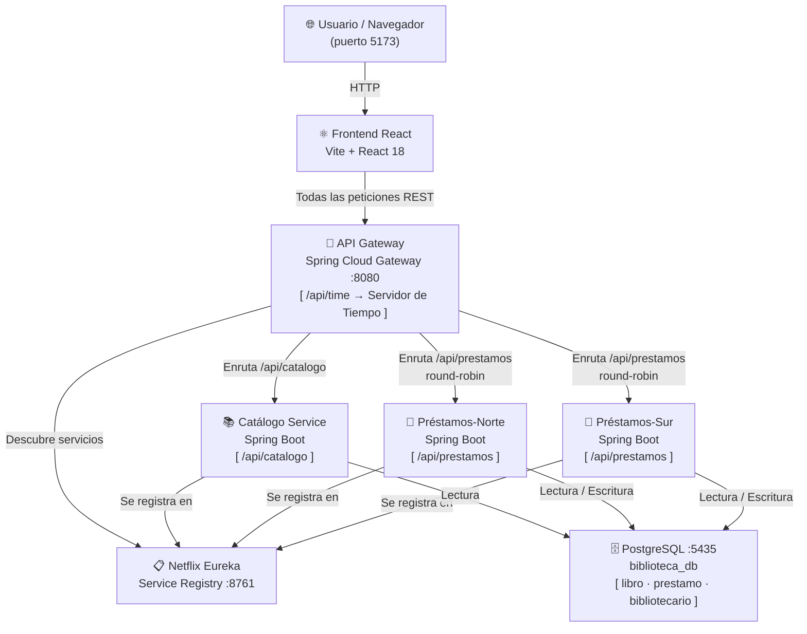
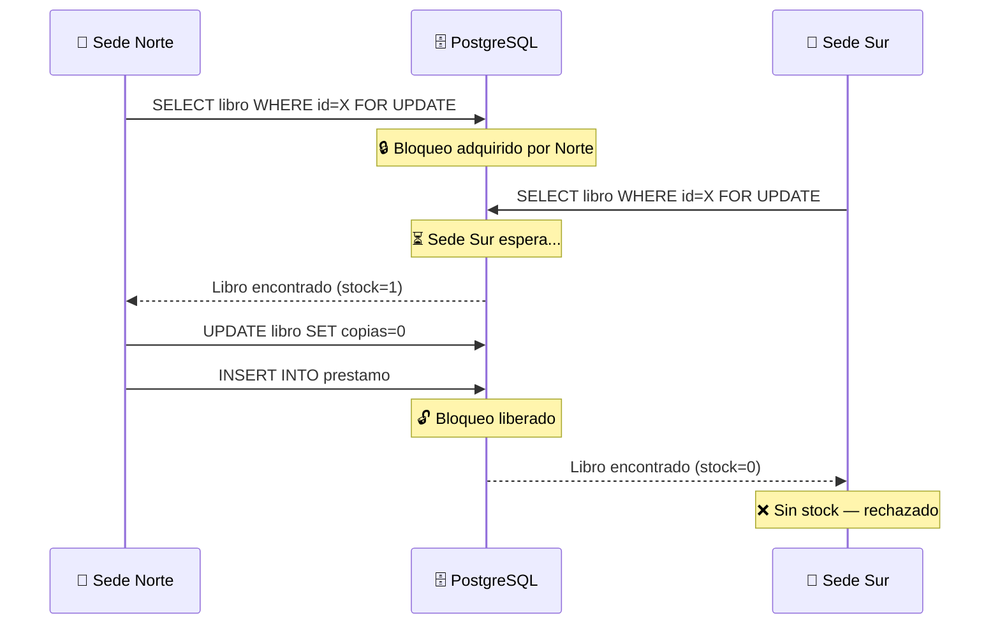
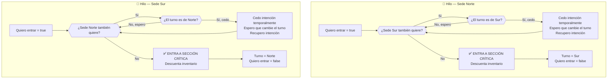
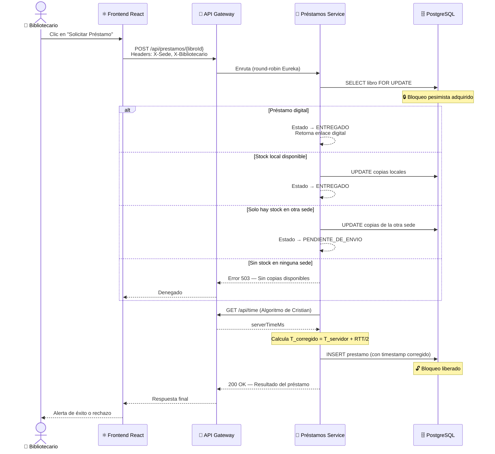
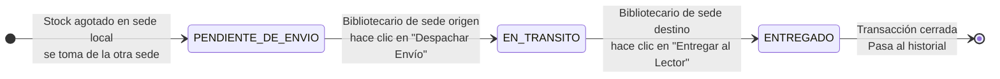
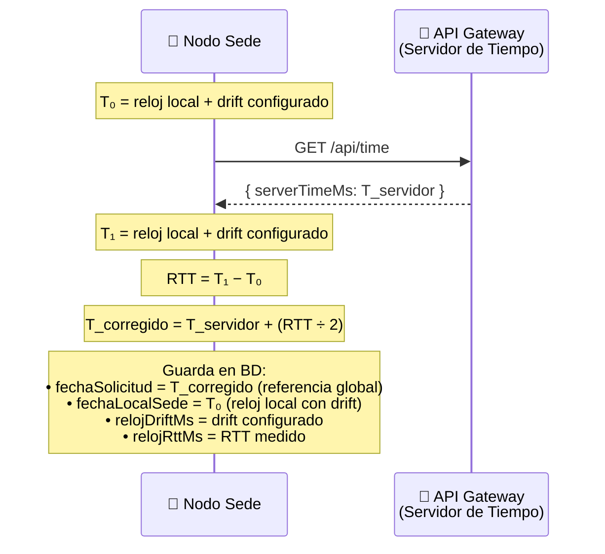
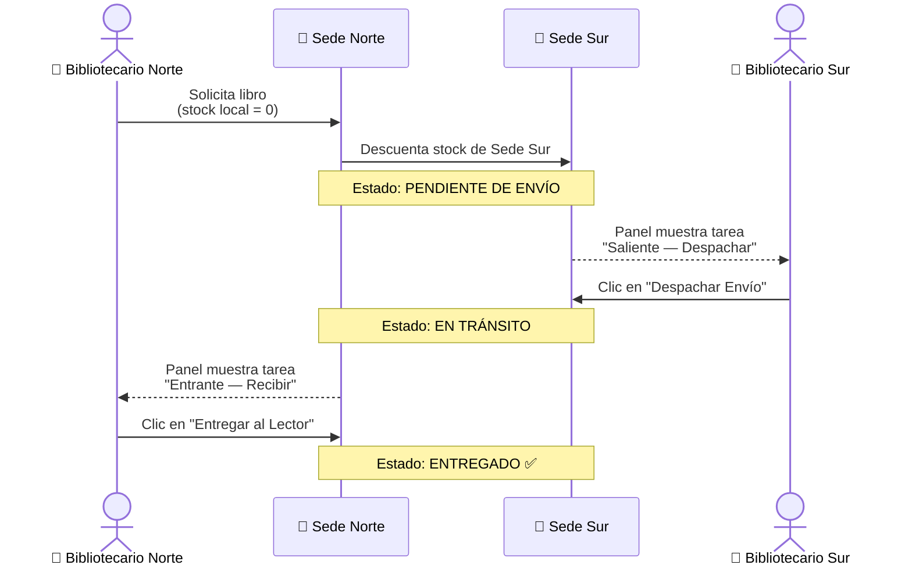
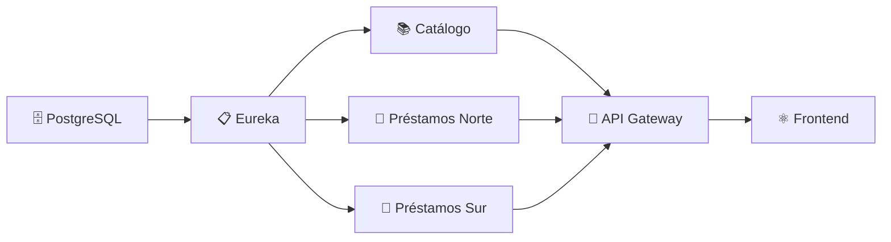

# 📚 LibroNet — Sistema Distribuido de Gestión Bibliotecaria

<div align="center">


**Sistema distribuido de préstamo y logística inter-bibliotecaria con exclusión mutua,  
sincronización de relojes y balanceo de carga.**

</div>

---

## 📋 Tabla de Contenidos

1. [Descripción del Sistema](#-descripción-del-sistema)
2. [Escenario de Funcionamiento](#-escenario-de-funcionamiento)
3. [Arquitectura General](#-arquitectura-general)
4. [Componentes del Sistema](#-componentes-del-sistema)
5. [Semana 13 — Exclusión Mutua: Algoritmo de Dekker](#-semana-13--exclusión-mutua-algoritmo-de-dekker)
6. [Flujo Completo de un Préstamo](#-flujo-completo-de-un-préstamo)
7. [Sincronización de Relojes — Algoritmo de Cristian](#-sincronización-de-relojes--algoritmo-de-cristian)
8. [Logística Inter-Sedes](#-logística-inter-sedes)
9. [Levantamiento del Sistema](#-levantamiento-del-sistema)
10. [Endpoints de la API](#-endpoints-de-la-api)
11. [Semana 14 — Elección de Líder: Algoritmo en Anillo Lógico](#-semana-14--elección-de-líder-algoritmo-en-anillo-lógico)

---

## 📖 Descripción del Sistema

**LibroNet** es un sistema distribuido de gestión bibliotecaria diseñado para coordinar el préstamo de libros entre dos sedes geográficamente separadas (**Sede Norte** y **Sede Sur**) sin un controlador central que genere un punto único de falla.

El sistema implementa conceptos fundamentales de **sistemas distribuidos**:

| Concepto | Implementación |
|----------|---------------|
| 🔒 Exclusión Mutua | Algoritmo de Dekker (Versión 5) con variables `volatile` compartidas |
| 🕐 Sincronización de Relojes | Algoritmo de Cristian vía servidor de tiempo en el API Gateway |
| ⚖️ Balanceo de Carga | Netflix Eureka + Spring Cloud Gateway (round-robin entre nodos) |
| 🗄️ Consistencia de Datos | Transacciones ACID con bloqueo pesimista a nivel de base de datos |
| 🚚 Logística Distribuida | Estados de préstamo: Pendiente → En Tránsito → Entregado |
| 👑 Elección de Líder | Algoritmo en Anillo Lógico (Chang-Roberts) dinámico con Eureka |

---

## 🏛️ Escenario de Funcionamiento

La biblioteca opera bajo el siguiente escenario real:

> **Una red universitaria con dos sedes físicas** — Sede Norte y Sede Sur — que comparten un catálogo de libros unificado. Cada sede tiene su propio inventario de ejemplares físicos, pero ambas pueden realizar préstamos sobre el stock de la otra sede cuando el suyo está agotado.

### Condiciones del escenario

> [!IMPORTANT]
> **Restricción principal:** Solo UN préstamo puede procesarse a la vez sobre un mismo libro (recurso compartido crítico). Si ambas sedes solicitan el último ejemplar simultáneamente, el sistema DEBE garantizar que solo una lo obtenga.

**Actores del sistema:**

| Actor | Descripción |
|-------|-------------|
| 👤 **Bibliotecario** | Empleado autenticado por sede y rol |
| 📗 **Libro** | Recurso con stock separado por sede y enlace digital |
| 🏢 **Sede** | Nodo distribuido con su propia instancia del servicio de préstamos |
| 🌐 **Gateway** | Único punto de entrada externo; actúa también como servidor de tiempo de referencia |

---

## 🏗️ Arquitectura General



---

## 🧩 Componentes del Sistema

### 1. Frontend — Interfaz de Usuario (React + Vite)

Aplicación SPA construida con React 18. Implementa:
- **Autenticación por sede**: Login de bibliotecario validado contra la base de datos; el acceso es restringido según sede y rol.
- **Catálogo en tiempo real**: Búsqueda de libros con auto-polling cada 5 segundos para reflejar cambios concurrentes.
- **Actualización optimista**: La UI descuenta el inventario visualmente de forma inmediata, con rollback si el servidor rechaza la operación.
- **Panel de Logística**: Vista bifurcada (logística activa / historial) con gestión de estados inter-sedes.
- **Modo Auditoría**: Revela los datos de sincronización de Cristian (Drift, RTT, hora corregida) por préstamo.

### 2. API Gateway — Spring Cloud Gateway

Punto de entrada único para todas las peticiones HTTP externas. Responsabilidades:
- **Enrutamiento dinámico** hacia el catálogo y el servicio de préstamos vía Eureka.
- **Balanceo de carga** automático entre los nodos Norte y Sur (round-robin).
- **Servidor de Tiempo de Referencia** — Expone un endpoint que retorna el tiempo actual del servidor, utilizado por cada nodo para ejecutar el Algoritmo de Cristian.

### 3. Catálogo Service — Catálogo de Libros

Microservicio de solo lectura que expone el inventario centralizado de libros con búsqueda por título/autor.

### 4. Préstamos Service — Motor de Préstamos (×2 instancias)

El servicio más crítico del sistema. Se despliega en **dos instancias simultáneas** (Norte y Sur), ambas registradas en Eureka. Responsabilidades:
- Procesar solicitudes de préstamo con bloqueo transaccional pesimista.
- Aplicar el **Algoritmo de Cristian** para corregir el timestamp de cada operación.
- Proveer el endpoint de simulación del **Algoritmo de Dekker** para demostración de exclusión mutua.
- Gestionar el ciclo de vida logístico de los préstamos inter-sedes.

### 5. Netflix Eureka — Service Registry

Registro de servicios. Todos los microservicios se registran aquí al arrancar; el Gateway consulta este registro para enrutar dinámicamente sin IPs hardcodeadas.

### 6. PostgreSQL — Base de Datos Compartida

Base de datos relacional única compartida por todas las instancias. Las tablas principales son:

| Tabla | Descripción |
|-------|-------------|
| `libro` | Inventario con copias separadas por Sede Norte y Sede Sur |
| `prestamo` | Registro auditable de cada transacción con timestamps de Cristian |
| `bibliotecario` | Usuarios del sistema con sede y rol asociados |

---

## 🔒 Semana 13 — Exclusión Mutua: Algoritmo de Dekker

### Contexto del Problema

Cuando **dos sedes solicitan simultáneamente el último ejemplar físico** de un libro, se produce una condición de carrera (*race condition*) sobre el inventario. Sin un mecanismo de exclusión mutua, ambas podrían leer `stock = 1`, ambas decrementarlo, y terminar con `stock = -1` — una inconsistencia crítica.

### Solución en Producción — Bloqueo Pesimista de Base de Datos

El sistema real protege el recurso compartido mediante **bloqueo pesimista a nivel de base de datos** (`SELECT FOR UPDATE`). Esto garantiza que solo una transacción pueda leer y modificar el inventario de un libro a la vez.



### Simulación Didáctica — Algoritmo de Dekker (Versión 5)

Se implementó un endpoint de simulación que demuestra el **Algoritmo de Dekker V5** con dos hilos concurrentes en memoria, modelando el escenario de las dos sedes sin usar primitivas del sistema operativo.

**Variables compartidas en memoria (todas `volatile`):**

| Variable | Rol |
|----------|-----|
| `quiereEntrarSedeNorte` | Bandera de intención de la Sede Norte |
| `quiereEntrarSedeSur` | Bandera de intención de la Sede Sur |
| `turno` | Indica cuál sede tiene prioridad en caso de empate |
| `inventarioSimulado` | El recurso compartido crítico (valor inicial = 1) |

> La palabra clave `volatile` garantiza **visibilidad** entre hilos en la JVM: ningún hilo puede cachear el valor localmente; siempre lee desde la memoria principal.

### Diagrama del Algoritmo de Dekker V5



### Propiedades Garantizadas

| Propiedad | Descripción | ¿Cumple? |
|-----------|-------------|----------|
| **Exclusión Mutua** | Nunca dos procesos en la sección crítica simultáneamente | ✅ |
| **Ausencia de Deadlock** | El sistema nunca queda bloqueado permanentemente | ✅ |
| **Ausencia de Starvation** | Ningún proceso espera indefinidamente gracias al turno | ✅ |
| **Sin Espera Activa Desenfrenada** | Cede el turno antes de re-intentar | ✅ |

### Resultado de la Simulación

Al invocar `GET /api/simulacion/dekker`, el sistema lanza ambos hilos simultáneamente y retorna la bitácora de eventos. El resultado garantizado es:

- ✅ **Sede Norte** entra a la sección crítica → descuenta inventario → sale → cede el turno.
- ✅ **Sede Sur** entra a la sección crítica → encuentra inventario en 0 → sale sin corrupción.
- ✅ Ningún proceso bloquea al otro de forma permanente.

---

## 🔄 Flujo Completo de un Préstamo

El siguiente diagrama describe el recorrido completo desde que el bibliotecario hace clic en "Solicitar Préstamo" hasta que el libro es entregado:



### Estados del Ciclo de Vida de un Préstamo Inter-Sedes



---

## 🕐 Sincronización de Relojes — Algoritmo de Cristian

En un sistema distribuido, cada nodo tiene su propio reloj físico que puede **derivar (drift)** con respecto al tiempo real. Si los préstamos se registran con timestamps incorrectos, el historial queda inconsistente.

### Cómo Funciona

Cada vez que se procesa un préstamo, el nodo ejecuta el **Algoritmo de Cristian**:



> La corrección **T_servidor + RTT/2** asume que la respuesta tardó exactamente la mitad del viaje de ida y vuelta — compensando el desfase del reloj local de cada sede.

### Datos Almacenados por Préstamo

| Campo | Descripción |
|-------|-------------|
| `fechaSolicitud` | Timestamp corregido por Cristian — tiempo de referencia global |
| `fechaLocalSede` | Timestamp del reloj local de la sede (con posible drift) |
| `relojDriftMs` | Desfase configurado para esa instancia (simulación) |
| `relojRttMs` | Round-Trip Time medido en la consulta al servidor de tiempo |

---

## 🚚 Logística Inter-Sedes

Cuando una sede no tiene stock local, el préstamo genera un flujo de logística física entre sedes:



---

## 🚀 Levantamiento del Sistema

### Pre-requisitos

- Docker Desktop instalado y en ejecución
- Git

### Pasos

```bash
# 1. Clonar el repositorio
git clone https://github.com/JeremiAlex04/Libro-Net.git
cd Libro-Net

# 2. Copiar variables de entorno
cp .env.example .env

# 3. Levantar todos los servicios
docker-compose up --build -d

# 4. Verificar que todos los servicios están corriendo
docker-compose ps
```

### Orden de Arranque



> Los servicios tienen **healthchecks** configurados en `docker-compose.yml` para garantizar este orden de arranque automáticamente.

### Verificación de Salud

| Servicio | URL | Descripción |
|----------|-----|-------------|
| Frontend | http://localhost:5173 | Interfaz de usuario |
| API Gateway | http://localhost:8080 | Punto de entrada REST |
| Eureka Dashboard | http://localhost:8761 | Panel de registro de servicios |
| PostgreSQL | localhost:5435 | Base de datos |

---

## 🛠️ Endpoints de la API

Todos los endpoints son accesibles a través del API Gateway en `http://localhost:8080`.

### Autenticación
| Método | Endpoint | Descripción |
|--------|----------|-------------|
| `POST` | `/api/auth/login` | Login de bibliotecario |

### Catálogo
| Método | Endpoint | Descripción |
|--------|----------|-------------|
| `GET` | `/api/catalogo/buscar?query={término}` | Buscar libros en el catálogo |

### Préstamos
| Método | Endpoint | Descripción |
|--------|----------|-------------|
| `POST` | `/api/prestamos/{libroId}?digital={bool}` | Solicitar préstamo (headers: `X-Sede`, `X-Bibliotecario`) |
| `GET` | `/api/prestamos` | Listar todos los préstamos |
| `PUT` | `/api/prestamos/{id}/estado?estado={estado}` | Actualizar estado logístico |

### Simulación & Utilidades
| Método | Endpoint | Descripción |
|--------|----------|-------------|
| `GET` | `/api/simulacion/dekker` | Ejecutar simulación del Algoritmo de Dekker V5 |
| `GET` | `/api/time` | Obtener tiempo de referencia del servidor (Algoritmo de Cristian) |
| `GET` | `/api/eleccion/estado` | Consultar estado del nodo en el anillo de elección |
| `POST` | `/api/eleccion/simular-caida?offline={bool}` | Simular caída/recuperación en caliente del nodo (retorna 503) |
| `POST` | `/api/eleccion/forzar-eleccion` | Forzar el inicio de un proceso de elección manual |

---

## 👑 Semana 14 — Elección de Líder: Algoritmo en Anillo Lógico

Para dotar al sistema de **alta disponibilidad y tolerancia a fallos**, se diseñó e implementó un mecanismo de elección de líder automatizado basado en el **Algoritmo en Anillo Lógico (Chang-Roberts)**.

### Concepto y Funcionamiento
1. **Configuración de Identidades**: Cada sede del microservicio de préstamos se configura con un `node-id` único (Sede Norte = `1`, Sede Sur = `2`) y se registra en Netflix Eureka, el cual actúa como el directorio compartido para descubrir la topología de la red.
2. **Estructura en Anillo**: Al arrancar o al detectar cambios en el clúster, los nodos recuperan las instancias activas del servicio en Eureka, las ordenan por su ID de menor a mayor y forman un anillo lógico direccional (ej. `Sede Norte (1) -> Sede Sur (2) -> Sede Norte (1)`).
3. **Heartbeat y Detección de Caídas**: Los nodos seguidores monitorean periódicamente (cada 5 segundos) la salud del líder mediante un ping directo. Si el líder deja de responder, el nodo que detecta la falla cambia su estado a `ELECTION` e inicia la votación.
4. **Paso de Mensajes (Chang-Roberts)**:
   - Se envía un mensaje `ELECTION(candidateId)` a su sucesor en el anillo.
   - Si un nodo recibe un ID candidato mayor que el suyo, lo reenvía. Si recibe un ID menor y no ha participado, inyecta su propio ID superior.
   - Si el mensaje `ELECTION(myId)` regresa al nodo emisor original, significa que tiene el ID más alto y ha ganado. Se autoproclama líder y envía un mensaje `COORDINATOR(myId)` alrededor del anillo para notificar el resultado.
5. **Omisión de Nodos Caídos**: Si un nodo no puede comunicarse con su sucesor inmediato (por estar caído), salta a ese nodo en el anillo e intenta transmitir el mensaje al sucesor del sucesor, garantizando la consistencia y continuidad del algoritmo.

### Demostración Visual de Tolerancia a Fallos
A través del **Modo Auditoría** en el frontend, se expone una consola gráfica interactiva para comprobar el algoritmo:
- **Simular Caída**: Configura un nodo como *Offline* (comienza a responder con error HTTP 503 y detiene sus transmisiones). El otro nodo detectará la caída en un intervalo de 5 segundos, iniciará la elección saltando al nodo caído y tomará el control como nuevo Líder.
- **Restaurar Nodo**: Levanta el nodo simulado. Este se conectará, descubrirá el líder actual del anillo y pasará a ser seguidor pacíficamente hasta que ocurra otra elección.

---

## ❓ Preguntas por Proyecto — Grupo 3: BiblioNet

### 1) ¿El recurso compartido es el ISBN, el libro o el ejemplar físico?
En la implementación actual, el recurso crítico compartido es el **stock lógico del libro por sede** (`copiasNorte`, `copiasSur`), no el ISBN ni un ejemplar físico individual.

- **Implementado:** control de concurrencia sobre la entidad `Libro`.
- **Si se requiere mayor granularidad:** modelar entidad `Ejemplar` por copia física y bloquear por `ejemplar_id`.

### 2) ¿Qué pasa si dos sedes reservan el mismo ejemplar?
Ambas solicitudes compiten por la misma fila de inventario y una queda esperando por bloqueo pesimista (`SELECT FOR UPDATE`). Solo una transacción descuenta primero; la segunda reevalúa stock actualizado y se aprueba o rechaza.

- **Implementado:** exclusión mutua por bloqueo pesimista en base de datos.

### 3) ¿La búsqueda de catálogo necesita exclusión mutua?
No, porque es operación de **solo lectura**. No modifica stock ni estado transaccional.

- **Implementado:** búsqueda por título en `catalogo-service` sin sección crítica.

### 4) ¿Qué operación del loan-service debe protegerse?
La sección crítica es la transacción de préstamo físico donde se:
1. Lee disponibilidad.
2. Decide sede de origen.
3. Descuenta stock.
4. Persiste el registro de préstamo.

- **Implementado:** `@Transactional` + `findByIdForUpdate(...)`.

### 5) ¿Cómo se valida disponibilidad antes de crear el préstamo?
Se obtiene el libro con bloqueo y se evalúa:
1. `localStock` de la sede solicitante.
2. `otherStock` de la otra sede.
3. Si ambos son `0`, se rechaza.
4. Si hay stock remoto, se crea préstamo inter-sede (`PENDIENTE_DE_ENVIO`) con autorización del líder.

- **Implementado:** validación en `PrestamoService`.

### 6) ¿Qué ocurre si dos solicitudes consultan disponibilidad al mismo tiempo?
No hay lectura inconsistente de stock para préstamo porque ambas solicitudes entran al flujo protegido por bloqueo de fila. Una entra primero; la otra espera y luego opera sobre estado actualizado.

- **Implementado:** serialización efectiva por bloqueo pesimista.

### 7) ¿Cómo se actualiza el stock por sede de forma consistente?
Dentro de una misma transacción:
1. Se decrementa `copiasNorte` o `copiasSur` según reglas de negocio.
2. Se guarda la entidad `Libro`.
3. Se registra `Prestamo` con estado y metadatos de auditoría.

- **Implementado:** actualización atómica de inventario + préstamo.

### 8) ¿Qué servicio podría funcionar como coordinador?
El coordinador de negocio inter-sede es el **líder electo de `prestamos-service`** (anillo lógico Chang-Roberts), no el gateway.

- **Implementado:** autorización inter-sede por líder (`/api/eleccion/autorizar-prestamo-inter-sede`).
- **Implementado:** robustez adicional con `liderazgoEpoca` para ignorar mensajes obsoletos.

### 9) ¿Qué log debería registrarse en cada préstamo?
Debe incluir, como mínimo:
1. `id` de préstamo y `libroId`.
2. sede solicitante y bibliotecario.
3. estado final (`ENTREGADO`, `PENDIENTE_DE_ENVIO`, etc.).
4. marca de tiempo corregida por Cristian (`fechaSolicitud`).
5. telemetría de reloj (`relojDriftMs`, `relojRttMs`).
6. líder que autorizó (`autorizadoPorLider`) en préstamos inter-sede.

- **Implementado:** estos campos se persisten en `Prestamo`.

### 10) ¿Cómo demostrar que no se prestó dos veces el mismo ejemplar?
Con una prueba concurrente sobre un libro con stock inicial `1`:
1. Lanzar dos solicitudes simultáneas de préstamo físico.
2. Verificar: exactamente 1 éxito y 1 rechazo (o espera + rechazo según timing).
3. Confirmar stock final en `0` y trazabilidad en historial.

- **Implementado parcialmente:** la garantía existe por bloqueo pesimista y bitácora de préstamos.
- **Recomendado para evidencia formal:** automatizar prueba de concurrencia (test de integración con múltiples hilos/clientes).

---

## 👥 Equipo

Proyecto desarrollado para el curso de **Sistemas Distribuidos** — Semana 13 y 14.

---

<div align="center">
<sub>LibroNet © 2025 — Sistema Distribuido de Gestión Bibliotecaria</sub>
</div>
