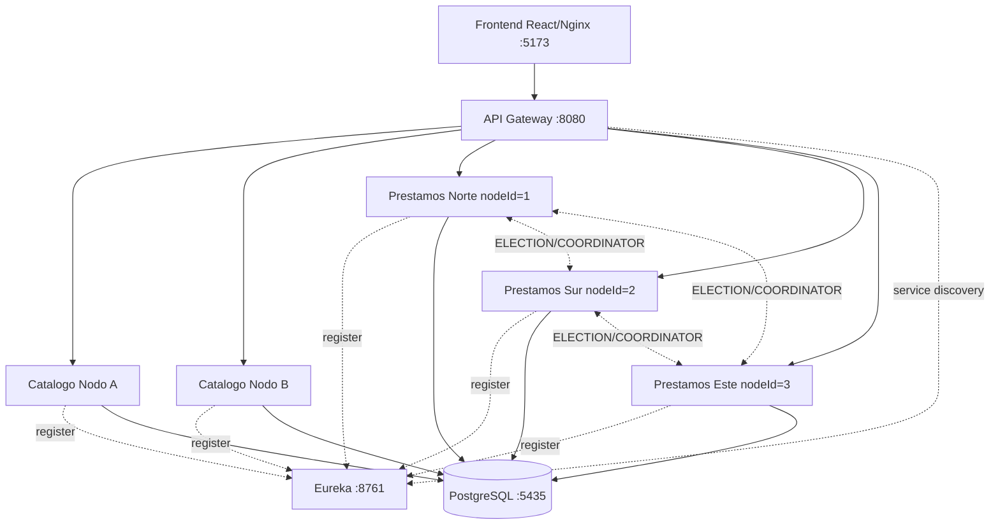

# LibroNet - Sistema Distribuido de Prestamos Bibliotecarios

LibroNet es un sistema distribuido orientado al curso de Sistemas Distribuidos. Implementa microservicios con Spring Boot, frontend en React, descubrimiento con Eureka, ruteo y balanceo desde API Gateway, persistencia en PostgreSQL y mecanismos de coordinacion distribuida para fallos y liderazgo.

Este README consolida el analisis tecnico del repositorio y documenta el funcionamiento real del sistema para desarrollo, pruebas y sustentacion final.

---

## 1. Resumen del sistema

LibroNet resuelve la gestion de prestamos entre sedes con foco en:

- Concurrencia sobre inventario fisico.
- Balanceo de carga verificable.
- Sincronizacion temporal de eventos.
- Eleccion de lider y recuperacion ante fallas.
- Trazabilidad para auditoria y demo.

Arquitectura base:

- Frontend React servido por Nginx.
- API Gateway como entrada unica.
- Eureka para registro y descubrimiento dinamico.
- Catalogo Service con replicas.
- Prestamos Service con nodos por sede.
- PostgreSQL como almacenamiento.

---

## 2. Arquitectura distribuida


```mermaid
graph TD
    FE[Frontend React/Nginx :5173]
    GW[API Gateway :8080]
    EU[Eureka :8761]
    CAT1[Catalogo Nodo A]
    CAT2[Catalogo Nodo B]
    PN[Prestamos Norte nodeId=1]
    PS[Prestamos Sur nodeId=2]
    PE[Prestamos Este nodeId=3]
    DB[(PostgreSQL :5435)]

    FE --> GW
    GW --> CAT1
    GW --> CAT2
    GW --> PN
    GW --> PS
    GW --> PE

    GW -.service discovery.-> EU
    CAT1 -.register.-> EU
    CAT2 -.register.-> EU
    PN -.register.-> EU
    PS -.register.-> EU
    PE -.register.-> EU

    CAT1 --> DB
    CAT2 --> DB
    PN --> DB
    PS --> DB
    PE --> DB

    PN <-. ELECTION/COORDINATOR .-> PS
    PS <-. ELECTION/COORDINATOR .-> PE
    PE <-. ELECTION/COORDINATOR .-> PN
```

---

## 3. Servicios y puertos

- Frontend: http://localhost:5173
- API Gateway: http://localhost:8080
- Eureka: http://localhost:8761
- PostgreSQL host: localhost:5435

Contenedores de negocio:

- catalogo
- catalogo-2
- prestamos-norte
- prestamos-sur
- prestamos-este

---

## 4. Funcionamiento por capas

### 4.1 API Gateway

Responsabilidades:

- Entrada unica al sistema.
- Ruteo por path hacia catalogo, prestamos, auth, simulacion y eleccion.
- Balanceo round-robin para rutas balanceadas.
- Exposicion de tiempo de referencia por endpoint de tiempo.
- Trazabilidad por headers y log de ruteo.

Evidencia de codigo:

- Configuracion round-robin: api-gateway/src/main/java/com/example/api_gateway/GatewayRoundRobinLoadBalancerConfig.java
- Filtro de auditoria de ruteo: api-gateway/src/main/java/com/example/api_gateway/GatewayRouteAuditFilter.java
- Endpoint de tiempo: api-gateway/src/main/java/com/example/api_gateway/TimeController.java

Headers de trazabilidad:

- X-Gateway-Routed-Host
- X-LibroNet-Instance

### 4.2 Catalogo Service

Responsabilidades:

- Busqueda de libros por titulo.
- Exposicion de endpoint de instancia para probar balanceo.

Evidencia de codigo:

- Controlador: catalogo-service/src/main/java/com/example/catalogo/controller/CatalogoController.java

### 4.3 Prestamos Service

Responsabilidades:

- Prestamos locales y digitales.
- Prestamos inter-sede con autorizacion de lider.
- Sincronizacion de tiempo con Cristian al registrar prestamo.
- Eleccion de lider, deteccion de falla y resincronizacion.
- Exposicion de estados y eventos para auditoria.

Evidencia de codigo:

- Logica de prestamo: prestamos-service/src/main/java/com/example/prestamos_service/service/PrestamoService.java
- Lock de inventario: prestamos-service/src/main/java/com/example/prestamos_service/repository/LibroRepository.java
- Liderazgo y fallos: prestamos-service/src/main/java/com/example/prestamos_service/service/LiderEleccionService.java
- Endpoints de eleccion: prestamos-service/src/main/java/com/example/prestamos_service/controller/EleccionController.java
- Auth: prestamos-service/src/main/java/com/example/prestamos_service/controller/AuthController.java

---

## 5. Conceptos de Sistemas Distribuidos aplicados

| Concepto | Implementacion en LibroNet | Componente |
|---|---|---|
| Comunicacion distribuida | HTTP/REST entre frontend, gateway y microservicios | Todos |
| Descubrimiento dinamico | Registro y resolucion por nombre logico | Eureka + clientes |
| Balanceo de carga | Round-robin en gateway | API Gateway |
| Exclusión mutua academica | Simulacion de Dekker | Endpoint de simulacion |
| Exclusión mutua real | Lock transaccional PESSIMISTIC_WRITE | Prestamos + PostgreSQL |
| Sincronizacion temporal | Algoritmo de Cristian usando /api/time | Prestamos + Gateway |
| Tolerancia a fallos | Deteccion de caida y re-eleccion de lider | Prestamos |
| Recuperacion controlada | Estado RESYNC antes de aceptar negocio | Prestamos |
| Observabilidad | Eventos de eleccion, headers de instancia y logs | Gateway + Prestamos + Frontend |

---

## 6. Diferencia clave: Dekker vs control real

Aclaracion obligatoria para sustentacion:

- Dekker V5 se usa como simulacion academica para explicar exclusion mutua.
- El control real de inventario se hace con bloqueo pesimista en base de datos mediante PESSIMISTIC_WRITE.

Implicacion:

- La garantia efectiva de no sobreventa en produccion depende del lock transaccional en PostgreSQL.

---

## 7. Flujo funcional principal

### 7.1 Prestamo local

1. Frontend envia solicitud al Gateway.
2. Gateway enruta a un nodo de prestamos.
3. Nodo toma lock del libro.
4. Si hay stock local, descuenta y registra.
5. Sincroniza tiempo con Cristian.
6. Guarda prestamo con metricas de drift y RTT.

### 7.2 Prestamo inter-sede

1. Nodo detecta stock local agotado y stock remoto disponible.
2. Solicita autorizacion al lider.
3. Si autoriza, descuenta remoto y registra estado PENDIENTE_DE_ENVIO.
4. Si el lider falla, activa retry con backoff y posible re-eleccion.
5. Si no converge autorizacion, se hace rollback transaccional.

### 7.3 Caida y recuperacion de nodo

1. Nodo puede pasar a OFFLINE por simulacion.
2. Monitor detecta ausencia de lider y dispara eleccion.
3. Se distribuyen mensajes ELECTION y COORDINATOR.
4. Nodo restaurado entra en RESYNC.
5. Solo vuelve a negocio cuando convergen estado y liderazgo.

---

## 8. Seguridad

Implementado:

- Login contra tabla bibliotecario en PostgreSQL.
- Passwords con BCrypt.
- Validacion de sede por usuario.

Observacion tecnica actual:

- Las operaciones de prestamo usan headers de sede y bibliotecario enviados por cliente.
- Para un entorno productivo, se recomienda evolucionar a autenticacion con token firmado y autorizacion server-side por claims.

---

## 9. Estado real del modelo de sedes

Importante para sustentacion honesta:

- La eleccion de lider y auditoria consideran tres nodos de prestamos: Norte, Sur, Este.
- El modelo de inventario fisico en base de datos usa copias_norte y copias_sur.
- La logica de prestamo valida Sede Norte y Sede Sur para negocio de stock.

Interpretacion:

- La tercera sede esta activa para topologia de liderazgo y tolerancia a fallos.
- El dominio de inventario fisico todavia esta modelado de forma bidireccional Norte/Sur.

---

## 10. Endpoints clave

Autenticacion:

- POST /api/auth/login

Catalogo:

- GET /api/catalogo/buscar?query=
- GET /api/catalogo/instancia

Prestamos:

- POST /api/prestamos/{libroId}?digital=true|false
- GET /api/prestamos
- PUT /api/prestamos/{id}/estado?estado=PENDIENTE_DE_ENVIO|EN_TRANSITO|ENTREGADO
- GET /api/prestamos/instancia

Tiempo:

- GET /api/time

Simulacion academica:

- GET /api/simulacion/dekker

Eleccion y fallas:

- GET /api/eleccion/estado
- GET /api/eleccion/eventos
- POST /api/eleccion/simular-caida?offline=true|false
- POST /api/eleccion/forzar-eleccion
- POST /api/eleccion/resincronizar
- GET /api/eleccion/autorizar-prestamo-inter-sede

Rutas directas por sede para auditoria:

- /api/eleccion/norte/**
- /api/eleccion/sur/**
- /api/eleccion/este/**

---

## 11. Ejecucion local con Docker

Prerequisitos:

- Docker Desktop en estado Running.
- Puerto 5173, 8080, 8761 y 5435 libres.
- Variables de .env definidas.

Comandos:

```bash
docker compose up -d --build
docker compose ps
```

Parado de stack:

```bash
docker compose down
```

---

## 12. Pruebas y evidencias para sustentacion

Se recomienda ejecutar las 5 pruebas minimas:

1. Prestamo local concurrente.
2. Balanceo round-robin.
3. Cristian (drift, RTT, tiempo corregido).
4. Caida de lider y re-eleccion.
5. Recuperacion con RESYNC.

Automatizacion incluida:

- Script: scripts/ejecutar_pruebas_sustentacion.ps1

Ejecucion:

```powershell
powershell -ExecutionPolicy Bypass -File .\scripts\ejecutar_pruebas_sustentacion.ps1
```

Salida:

- Evidencias en carpeta evidencias/pruebas_YYYYMMDD_HHMMSS con JSON y TXT para tabla de resultados.

Documento de apoyo:

- Plan completo de sustentacion: plan_sustentacion_final.md

---

## 13. Estructura sugerida de demo

1. Levantar Docker Compose.
2. Mostrar Eureka con servicios registrados.
3. Ingresar al sistema.
4. Buscar catalogo.
5. Probar round-robin con headers/logs.
6. Ejecutar prestamo local.
7. Ejecutar prestamo inter-sede.
8. Simular caida del lider.
9. Mostrar nuevo lider en estados/eventos.
10. Recuperar nodo y verificar RESYNC.
11. Cerrar con limitaciones y mejoras.

---

## 14. Despliegue en Render

El repositorio ya incluye un blueprint base en `render.yaml` para desplegar la topologia en Render usando Docker por servicio.

Consideraciones importantes:

- Render no ejecuta `docker-compose.yml`, por eso cada microservicio se declara por separado en `render.yaml`.
- Los servicios Java quedaron parametrizados con `PORT`, `EUREKA_HOSTPORT` y variables de datasource para funcionar tanto localmente como en Render.
- El frontend usa Nginx con proxy inverso a `/api`, por lo que la aplicacion publica sigue entrando por una sola URL.
- La base de datos se define como Render Postgres y los servicios convierten automaticamente `DATABASE_URL` a JDBC en arranque.
- Si usas plan `free`, los servicios pueden hibernar y afectar las demos de descubrimiento, balanceo y eleccion de lider.

Pasos sugeridos:

1. Sube el repositorio a GitHub.
2. En Render, crea un nuevo Blueprint y selecciona este repositorio.
3. Revisa `render.yaml` y confirma la creacion de 7 servicios web mas la base de datos.
4. Espera primero a que `libronet-eureka` y `libronet-db` queden operativos.
5. Valida luego que el frontend cargue y que `/api/time` responda a traves del proxy.

Recomendacion practica:

- Para sustentacion, conviene cambiar los servicios criticos desde `free` a `starter` si necesitas evitar sleep y reducir latencia de arranque.

---

## 14. Limitaciones actuales y mejoras futuras

Limitaciones:

- Dependencia de BD centralizada.
- Ventana temporal sin lider para ruta inter-sede.
- Modelo de stock fisico aun en 2 sedes (Norte/Sur).
- Cobertura de pruebas automatizadas aun baja en unit/integration tests.

Mejoras propuestas:

- Tokenizacion de seguridad y autorizacion robusta.
- Extender modelo de inventario a sede dinamica completa.
- Persistencia distribuida de estado de liderazgo.
- Mayor cobertura de pruebas de carga, caos y resiliencia.
- Evaluar protocolos de consenso fuerte para escenarios de produccion.

---

## 15. Documentos del repositorio

- Documentacion tecnica extendida: Documentacion.md
- Informe Semana 13: informe_semana13.md
- Informe Semana 14: informe_semana14.md
- Plan de sustentacion final: plan_sustentacion_final.md

---

## 16. Nota de uso academico

Este proyecto prioriza demostrabilidad de conceptos de Sistemas Distribuidos en entorno controlado de laboratorio. Para evolucion a entorno empresarial se requiere endurecimiento en seguridad, pruebas de resiliencia y modelo de datos multi-sede completo.
